# Project Report: Tennis Racquet Data Dashboard

## 1. Data

The dataset "Tennis Racquets specs", made publicly available under the "CC0: Public Domain" creative commons license available on Kaggle by "Leoyuanluo" at https://www.kaggle.com/datasets/leoyuanluo/tennis-racquets-specs was selected for the following reasons.

* This dataset although containing only 213 samples, still contains 15 useful attributes and very few missing values.

* This dataset contains attributes of various data types. This variety provides scope for multiple visualization techniques.

* Upon EDA, it was found that there is correlation between some attributes. Clustering was also observed. Thus, this dataset may contain relationships between variables or patterns or trends which may contribute to an interesting investigation which could unearth a useful data driven narrative.

**The contents of "eda.ipynb" found at "./code" is as follows.**

* 1. Get Data

* 2. Attributes Of Interest

* 3. Preprocess Data

* 4. Save Preprocessed Data As CSV

* 5. Explore Data

* References

**1. Get Data**

This section begins with reading data from a csv file and storing it as a pandas `DataFrame` for easier analysis.

Next, an online search was conducted to gather information about the attributes of the dataset in order to determine what they signify. The description of the dataset found at [Tennis Racquets specs | Kaggle](https://www.kaggle.com/datasets/leoyuanluo/tennis-racquets-specs) was helpful.  

<p align="center">
  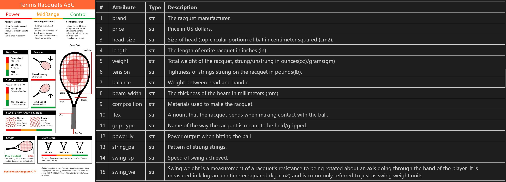
  <figcaption><i>"Tennis Racquets ABC" image from besttennisracquets.com found at https://pin.it/4sk6qVJ made available by "Vice Versa design studio".</i></figcaption>
</p>

A function called `print_attribute_table()` was written in python to output the markdown code for the above table. This function uses python's `type()` function to determine type of each attribute.

```python
def print_attribute_table(df):
    sample = df.iloc[0]
    print("|#|Attribute|Type|Description|")
    print("|-----|-----|-----|-----|")
    for i, col in zip(range(1,len(df.columns)+1), df.columns):
        col_type = str(type(sample[col]))
        col_type = col_type[col_type.index("'")+1:col_type.rindex("'")]
        print(f"|{i}|{col}|{col_type}|?|")
```

**2. Attributes of Interest**

All attributes but `grip_type` were initially identified as useful attributes. It was observed that all attributes were of type string even though most of them should be numeric. Also, many attributes were in a mixed format or had unnecessary metadata (like `price` values has the $ symbol).

<p align="center">
  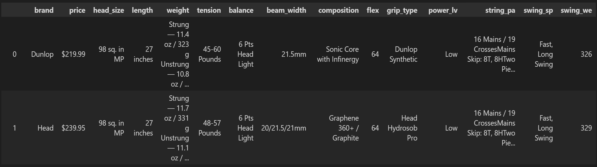
</p>

Thus, values of the identified attributes had to be cleaned. This constituted the data processing stage.

**3. Data Processing**

The useful attributes identified were processed as follows. 

* `price` : Symbol "$" was removed and values were made to be of type float.

* `head_size` : Less useful metadata like "sq. in MP" and "sq. in OS" was removed and the values were made to be of type float. (The MP and OS here was found to refer to head size categories such as Mid Plus and Over Sized.)

* `length` : The unit "inches" were removed and values were made to be of type float.

* `weight` : Weight of the racquets were given when they were strung (with strings) and unstrung (without strings) in both ounces and grams. The average weight of the racquet in grams was extracted.

* `tension` : Tension (referring to string tension/tension that the strings can bear) had the unit "pounds" in its values which were removed. Also, tension was available as a range like '45-60', '48-57', etc. Here, these ranges were reduced to one number by computing the mean value of minimum and maximum numbers in each range.

* `balance` : There are three different categories of balance. They are "Head Heavy" (head heavier than handle), "Head Light" (handle heavier than head) and "Balanced" (head and handle have equal weight). These categories were extracted from values and label encoded based on head weight (head light = 0, balanced = 1 and head heavy = 2) while extra less significant data such as the points by which a racquet belonged to each category was dropped.

* `beam_width` : The unit "mm" was removed and the values were made to be of type float. Some instances, had more than 1 value for beam width in which case the average was calculated.

* `composition` : String values were made lowercase and the special character "/" was removed.

* `flex` : Values incorrectly of type string were made to be of type float.

* `power` : The categories "Low", "Medium" and "High" were label encoded as 0, 1, and 2 respectively.

* `speed` : The categories "Slow", "Medium" and "Fast" were label encoded as 0, 1, and 2 respectively.

* `swing_we` : Swing weight values incorrectly of type string were made to be of type float.

* `string_pa` : String pattern values represented in the form AxB (e.g. 16x18) referring to A no. of main (vertical) strings and B no. of  cross (horizontal) strings were split into 2 columns, "main_strings", "cross_strings".

Instances with misaligned values for the no. of columns were dropped from the dataset.

Each racquet was given a `name` attribute which was generated by combining the string "Racquet" with the index of the racquet. This attribute provides a unique value with which each racquet may be identified.

The dataset after cleaning and processing contained 210 rows and 16 columns.

<p align="center">
  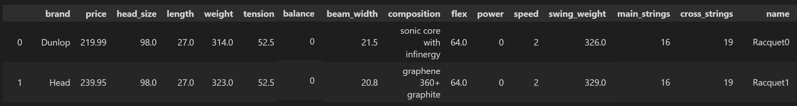
</p>

Attributes `main_strings` and `cross_strings` were later deemed less useful, especially since attribute tension referring to string tension already exists, and thus were dropped.

The final dataset using which the visualization was created contained 210 rows and 14 attributes described as below.

<p align="center">
  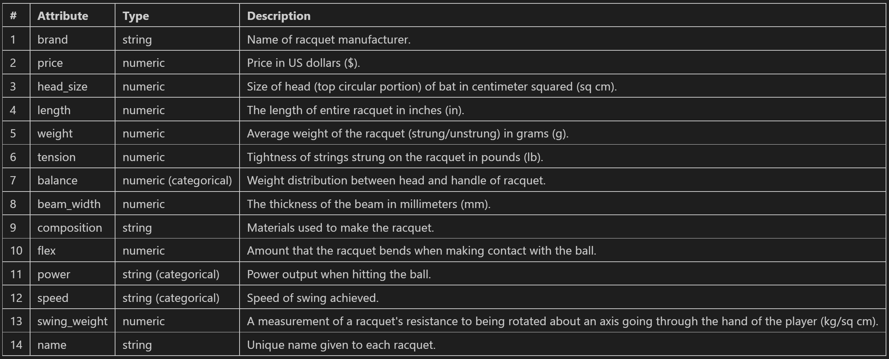
</p>

**5. Explore Data**

This section of EDA involved plotting pair plots and a correlation matrix of attributes to view any correlation that may exist between attributes. The colour of points in the pair plots were assigned based on power/speed the racquet can deliver to see if clustering can be observed.

<p align="center">
  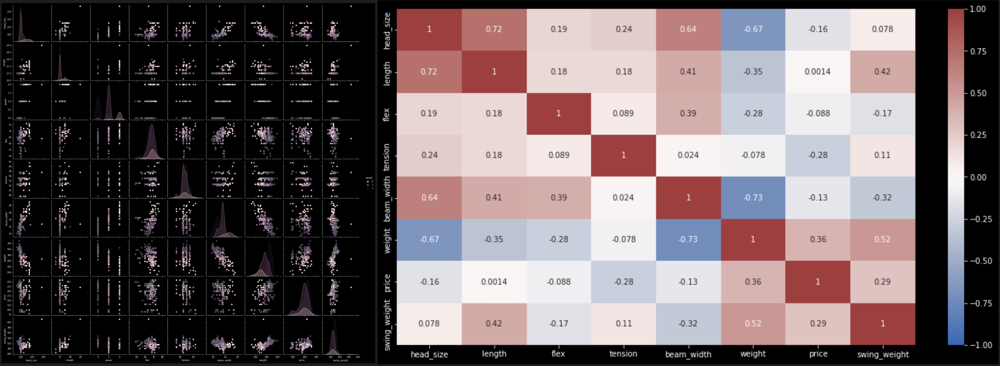
</p>

**Insights Gained**

The following insights were gained about the dataset at the end of EDA.

* There seemed to be some significant and non-spurious correlation between some attributes. The scatter plots also show clustering in terms of power and speed. Thus, displaying data using a scatter plot would be most informative.

* To compare an attribute of one racquet with that of others, a histogram may be plotted.

* A way to judge the distribution of points in this dataset w.r.t. power/speed may be beneficial in gauging its soundness in terms of being a valid sample that represents the whole. A pie chart may be a good way to do this.

* A word cloud that shows all the different materials used to make the racquets can quickly help identify the most common materials used to make racquets. This information may be useful since it can be the case that racquets made using some materials provide better performance over those made with other materials.

## 2. Visualization And Code

This section aims to summarize visual content on the dashboard and possible interaction.

#### 2.1. Visuals And Interaction

The dashboard has been organized into 5 main sections, "store", "pie", "word cloud", "scatter" and "bar".

Once the visualization loads, the 1st thing that the user sees is the model tennis racquet store where all data points are displayed as racquets which reflect their attribute values. The length, head size, beam width, head colour and handle colour of each racquet displayed on screen is customized as per data associated with respective data point. 

The head colour of the racquet represents speed that it can deliver while its handle colour represents the power it can deliver. Grey, orange and red colours represent low, medium or high speed/power. In context of racquet balance, grey, orange and red points in the scatter plot refer to head light, balanced and head heavy respectively.

<p align="center">
  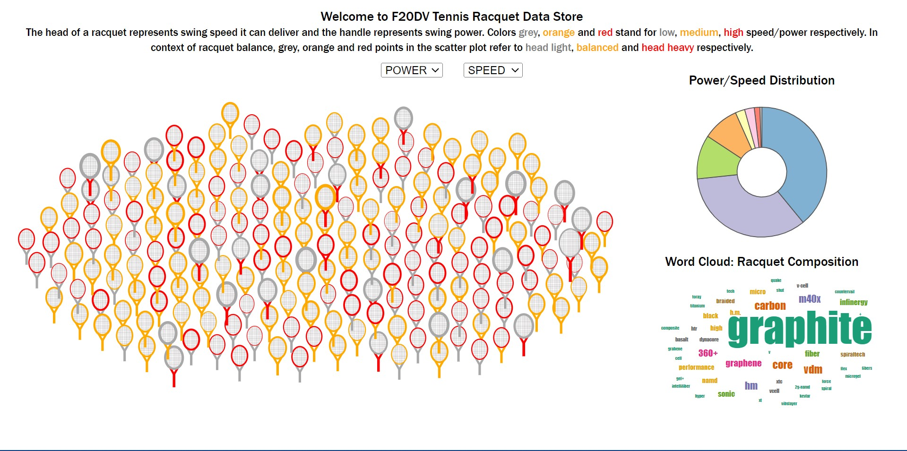
</p>

Hovering over a racquet makes it bigger and brings it to the front for more clear viewing. Clicking a racquet shifts view to focus on that racquet in a smooth transition.

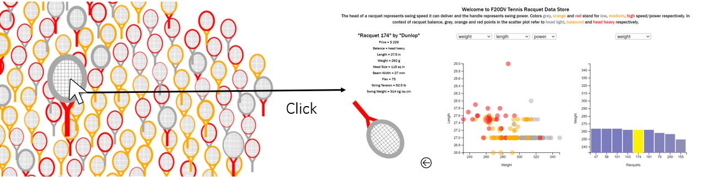

The power and speed dropdown menus can be used to filter out racquets with particular power/speed values. Selecting values from both filters like for example, high from speed dropdown and medium from power dropdown will result in both filters being applied such that data displayed changes to reflect racquets that deliver high speed and medium power. To unselect, the default option "POWER" or "SPEED" may be selected again. The word cloud and pie chart both get updated through smooth transitions as per filters applied.

<p align="center">
  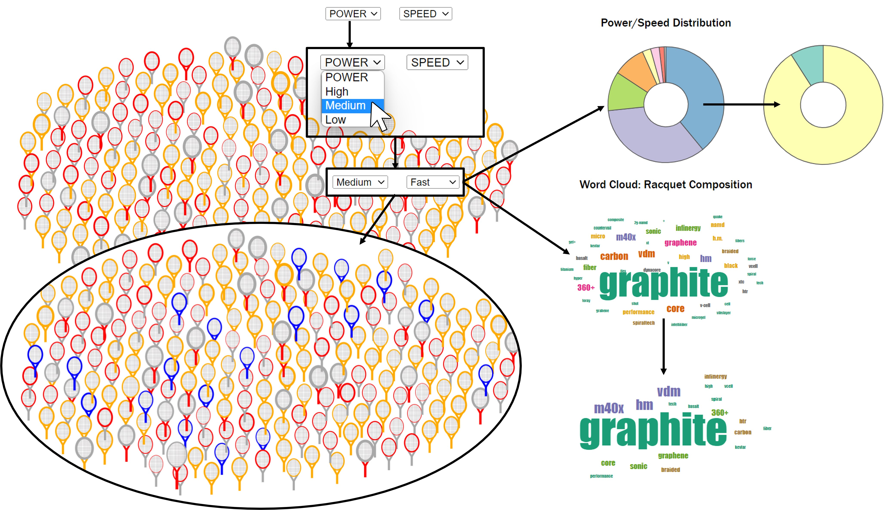
</p>

In the pie chart, hovering over a wedge highlights it blue and displays its value above the pie chart. Clicking wedges of the pie chart also filters data on screen such that both the store as well as word cloud gets updated as per data corresponding to selected wedge. Selecting a selected wedge again clears the applied filter.

<p align="center">
  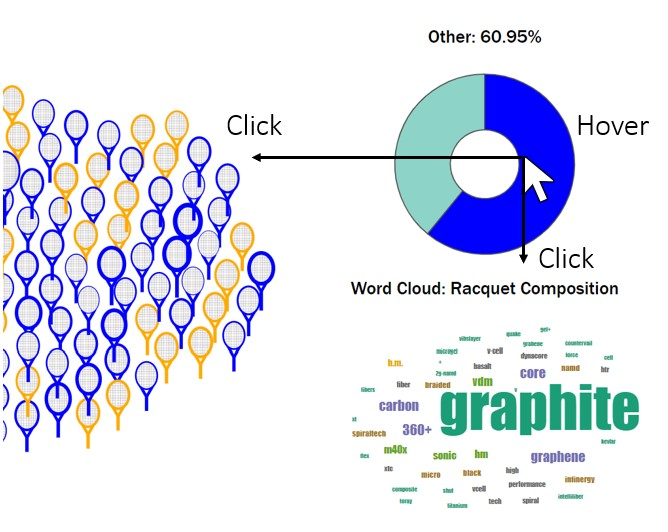
</p>

When a racquet is clicked, the power and speed filters disappear along with unselected racquets, the pie layout and the word cloud layout in a smooth transition to reveal a focused view with selected racquet details, a scatter plot, a bar plot and new associated dropdown menus.

<p align="center">
  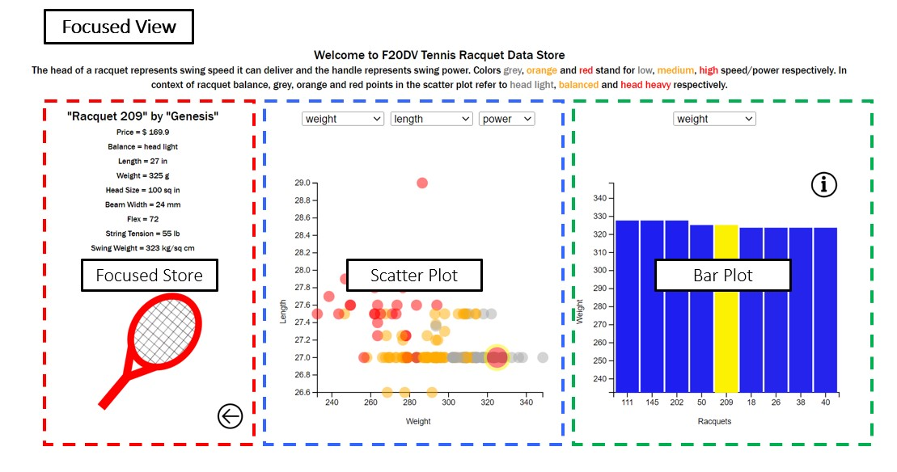
</p>

The specifications associated with the selected racquet is displayed in the focused store view. Hovering over the [back arrow icon](https://www.svgrepo.com/svg/120069/back) highlights it and clicking it takes the user back to the main view where all racquets in store layout as well as the pie and word cloud layout are visible.

<p align="center">
  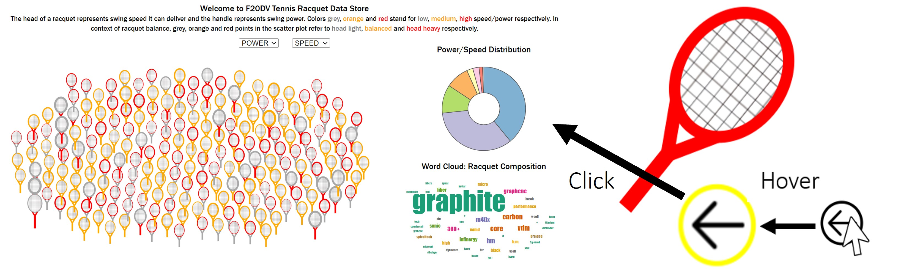
</p>

The racquet in the focused store view is rotated appropriately to convey the kind of balance it has.

<p align="center">
  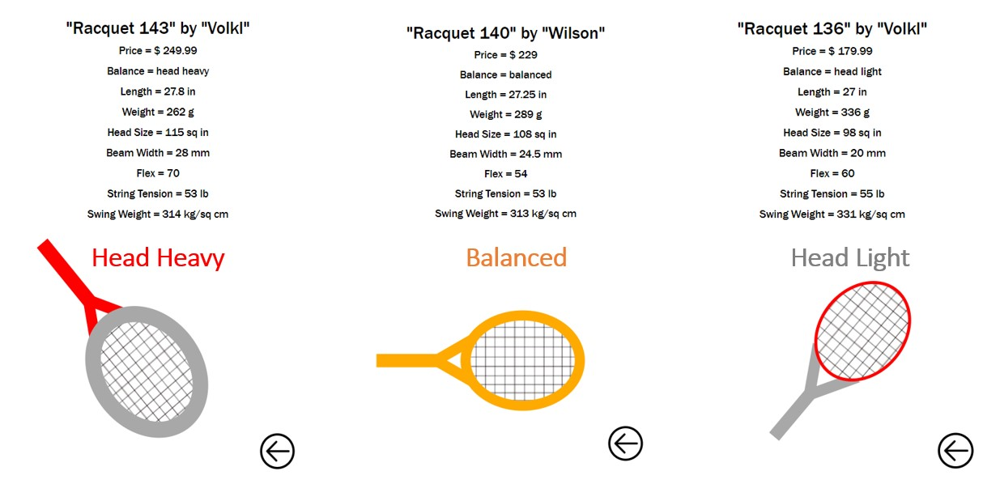
</p>

In the scatter plot layout, by default, x axis corresponds to the "weight" parameter and y axis corresponds to the "length" parameter. The x and y axes can be changed using the 1st and 2nd dropdown menus respectively. The axis that the dropdown menu corresponds to is indicated in the menu by means of a disabled option. 

The parameter that the colours/hue of the dots indicate can be changed using the 3rd dropdown whose value is by default "power". When "power"/"speed" is selected hue option, dots that have high power/fast speed appear red, those with medium power/speed appear orange and those will low power/slow speed appear grey with some transparency to ensure that overlapping dots are visible. If the hue option selected is "balance", then the red, orange and grey dots signify "head heavy", "balanced" or "head light" racquet balance respectively. 

Each dot in the plot corresponds to a racquet data point with the dot of the selected racquet indicated using bigger radius and a yellow outline.

<p align="center">
  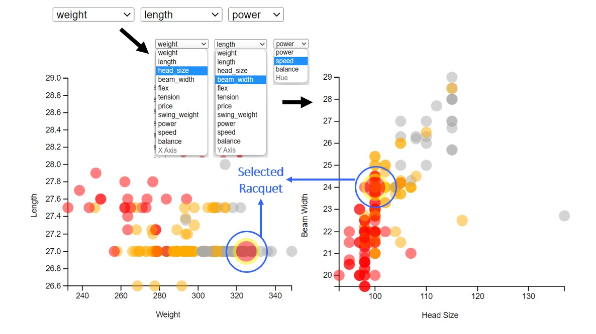
</p>

Hovering over a dot displays its racquet number above it and also brings it to the front of other dots. Moreover, hovering over a dot of one colour highlights all other dots of the same colour. This feature was implemented to help identify clusters more clearly.

Clicking any dot updates all layouts (focused store, scatter, bar) in this view to change focus to the racquet associated with the newly selected data point.

<p align="center">
  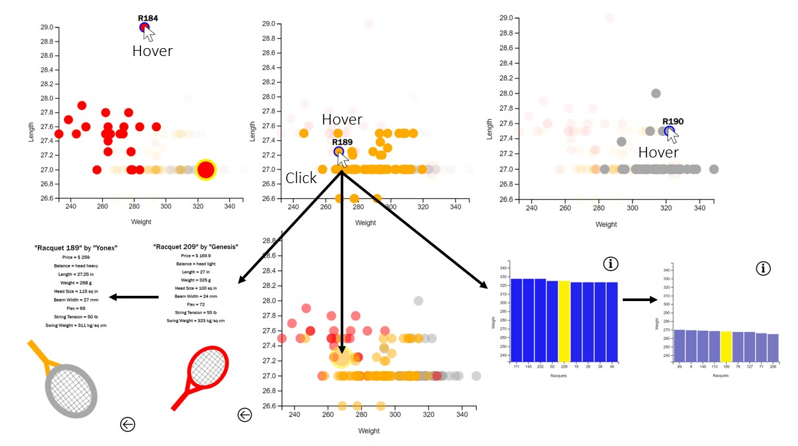
</p>

In the bar plot, the yellow bar represents selected racquet. The x axis contains numbers standing for every racquet arranged in decreasing order based on chosen y axis parameter which is by default "weight". The y axis parameter can be changed using the dropdown menu. Bars with higher y-axis values are more blue while ones with lower values are more grey.

<p align="center">
  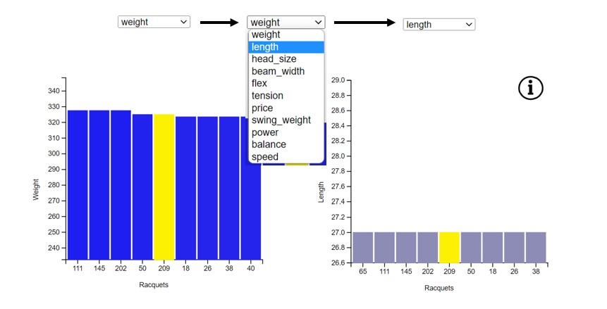
</p>

Hovering over a bar highlights it in red and displays its value above the bar and corresponding x-axis tick label if not already visible. Clicking a bar selects the associated racquet and updates all 3 layouts (focused store, scatter and bar).

<p align="center">
  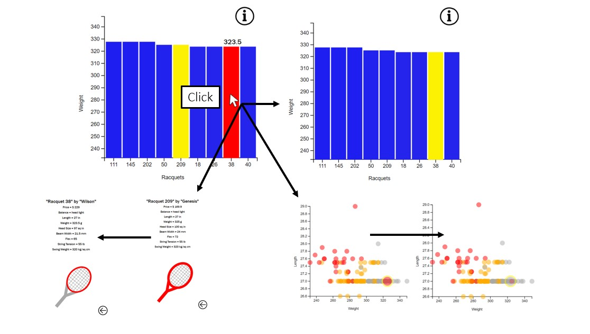
</p>

By default, only 9 bars are displayed. Pressing the up arrow key zooms into the bar graph and pressing the down arrow key zooms out. Pressing the left and right arrow keys help traverse the graph laterally. The zoom/bar traverse option only becomes available when the cursor is over the bar plot layout. This fluid implementation style was chosen so that all bars need not be displayed at the same time which would lead to the plot looking cluttered. Clicking the [info icon](https://www.svgrepo.com/svg/126305/info) displays text that educates the user about this feature. When there are up to 11 bars on screen, the x-axis labels are always visible. When there are more bars, the x-axis tick labels only appear upon hover.

<p align="center">
  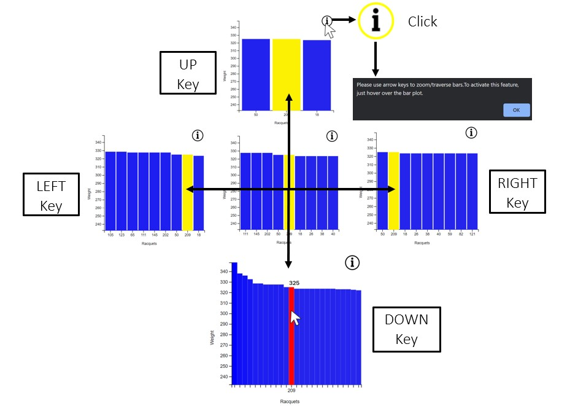
</p>

#### 2.2. HTML

The html file "index.html" that can be found at "./code" contains the basic components of the dashboard, the contents of which is populated using javascript and d3.js.

The html file links to 1 css file called "index.css" where styles associated with some components on screen are set, and also to 3 javascript files as listed below.

* "index.js": The main file where all javascript and d3.js code related to this project can be found.

* "d3.v7.min.js": The file where d3.js is defined.

* "d3.layout.cloud.js": A d3-cloud plugin by Jason Davies that is required to draw the word cloud.

All components of the dashboard are placed within a `div` with id "container". 

<u>index.js</u>

```html
<!DOCTYPE html>
<html lang="en">
    <head>
        <meta charset="UTF-8">
        <meta http-equiv="X-UA-Compatible" content="IE=edge">
        <meta name="viewport" content="width=device-width, 
            initial-scale=1.0">
        <title>Tennis Racquet Store</title>
        <link rel="stylesheet" type="text/css" href="./index.css">
        <script src="https://cdn.jsdelivr.net/gh/holtzy/D3-graph-gallery
@master/LIB/d3.layout.cloud.js"></script>
        <script src='https://d3js.org/d3.v7.min.js'></script>
    </head>
    <body>
        <div id="container">...</div>
        <script src='./index.js'></script>
    </body>
</html>
```

Within the `container`,  there are 3 `div` elements with ids "welcome", "main_panel" and "side_panel".

<u>index.js</u>

```html
...
<div id="container">
    <div id="welcome">...</div>
    <div id="main_panel" class="show">...</div>
    <div id="side_panel" class="hide">...</div>
</div>
...
```

The `welcome` div contains the title of the dashboard and some text that informs the user about how to interpret the dashboard. It also contains 2 empty `span` elements with ids "power_filter" and "speed_filter" where later the power and speed dropdown menus shall be added from within the javascript file.

<u>index.js</u>

```html
...
<div id="welcome">
    Welcome to F20DV Tennis Racquet Data Store<br/>
    <font size="2em">
        The head of a racquet represents swing 
        speed it can deliver and the handle represents
        swing power. Colors 
        <font color="grey">grey</font>, 
        <font color="orange">orange</font> and 
        <font color="red">red</font> stand for 
        <font color="grey">low</font>, 
        <font color="orange">medium</font>, 
        <font color="red">high</font> speed/power respectively.
        In context of racquet balance, grey, orange and red points 
        in the scatter plot refer to 
        <font color="grey">head light</font>, 
        <font color="orange">balanced</font> and 
        <font color="red">head heavy</font> respectively.
    </font><br/>
    <span id="power_filter"></span>
    <span id="speed_filter"></span>
</div>
...
```

<u>**MAIN PANEL**</u>

The `main_panel` element has the class name "show" so that associated styles can be applied such that this section is what is visible to the user on initial loading of the dashboard.  The `main_panel` contains 2 empty `div` elements with ids "store_header" and "store_empty_div" along with 2 `svg` elements with ids "store_svg" and "store_side_panel". 

<u>index.html</u>

```html
...
<div id="main_panel" class="show">
    <div id="store_header"></div>
    <div id="store_empty_div"></div>
    <svg id="store_svg" width="100%" height="100%">...</svg>
    <div id="store_side_panel">...</div>
</div>
...
```

The `store_header` will later contain the description of each selected racquet. The `store_empty_div` element is just a placeholder element so that column 2, row 2 of the 2 by 2 grid display of the `main_panel` contains some element and is not empty.

The `store_svg` element is where all components of the racquet store shall be added later using javascript and d3.js. It has 2 image patterns defined within, that is to be set as fill images of `ellipse`/`circle` images to depict the strings of the racquet and the back to store button.

<u>index.html</u>

```html
...
<svg id="store_svg" width="100%" height="100%">
    <defs> 
        <!-- strings_img obtained from: 
            https://freesvg.org/60gon-rectangle-grid -->
        <pattern 
            id="strings_img" x="0" y="0" 
            patternUnits="userSpaceOnUse" 
            height="50" width="50"
        ><image 
            x="-20" y="-10" height="50" width="50" 
            xlink:href="../images/strings.png" 
        /></pattern> 
        <!-- back_icon obtained from: 
            https://www.svgrepo.com/svg/120069/back -->
        <pattern 
            id="back_icon" x="-15" y="-15" 
            patternUnits="userSpaceOnUse" 
            height="30" width="30"
        ><image 
            x="0" y="0" height="30" width="30" 
            xlink:href="../images/back_icon.svg" 
        /></pattern>
    </defs> 
</svg>
...
```

The `"store_side_panel` element contains 2 `div` elements with ids "pie_div" and "word_cloud_div".

<u>index.html</u>

```html
...
<div id="store_side_panel">
    <div id="pie_div">...</div>
    <div id="word_cloud_div">...</div>
</div>
...
```

The `pie_div` element contains components related to the pie plot layout. It has within it, a `div` element with id "pie_header" which contains the title given to the pie plot and an empty `svg` element with id "pie_svg" where all elements of the pie chart shall be added later using javascript/d3.js.

<u>index.html</u>

```html
...
<div id="pie_div">
    <div id="pie_header">Power/Speed Distribution</div>
    <svg id="pie_svg" width="100%" height="100%"></svg>
</div>
...
```

Similarly, the `word_cloud_div` also contains a `word_cloud_header` and a `word_cloud_svg` associated with the word cloud layout.

<u>index.html</u>

```html
...
<div id="word_cloud_div">
    <div id="word_cloud_header">Word Cloud: Racquet Composition</div>
    <svg id="word_cloud_svg" width="100%" height="100%"></svg>
</div>
...
```

<u><strong>SIDE PANEL</strong></u>

The `side_panel` element has the class name "hide" so that associated styles can be applied such that this section is hidden from view on initial page load. The `side_panel` contains 2 empty `div` elements with ids "scatter_div" and "bar_div".

<u>index.html</u>

```html
...
<div id="side_panel" class="hide">
    <div id="scatter_div">...</div>
    <div id="bar_div">...</div>
</div>
...
```

The `scatter_div` element contains an empty `div` element with id "scatter_header" which will later contain the scatter plot dropdown menus used to set axes parameters or hue of dots on the plot and an empty `svg` element with id "scatter_svg" which shall contain all components associated with the scatter plot to be drawn.

<u>index.html</u>

```html
...
<div id="scatter_div">
    <div id="scatter_header"></div>
    <svg id="scatter_svg"width="100%" height="100%"></svg>
</div>
...
```

Similarly, `bar_div` also contains a `bar_header` and `bar_svg` such that `bar_svg` also contains within it, an image pattern to be used as fill colour of a circle element that shall later be added so as to be used as the "info" button on the bar plot.

<u>index.html</u>

```html
...
<div id="bar_div">
    <div id="bar_header"></div>
    <svg id="bar_svg" width="100%" height="100%">
        <defs> 
            <!-- info_icon obtained from:
                https://www.svgrepo.com/svg/126305/info -->
            <pattern 
                id="info_icon" x="25" y="24" 
                patternUnits="userSpaceOnUse" 
                height="35" width="35" 
            ><image 
                x="0" y="0" height="20" width="20" 
                xlink:href="../images/info_icon.svg" 
            /></pattern> 
    </svg>
</div>
...
```

The CSS file, "index.css" that can be found at "./code" contains styles assigned to elements of the page. It begins with styles that set the arrangement of elements on the screen as shown below.

<p align="center">
  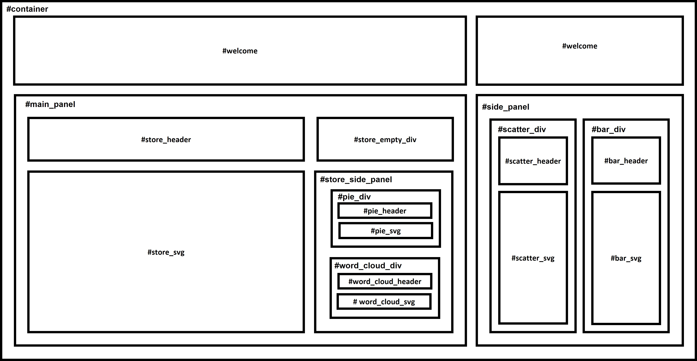
</p>

<u>index.css</u>

```css
/* container organization and grid layout */
body, html {
    margin:0; padding:0;
    width:99.5vw; height:99.5vh;
}

#container {
    position:relative;
    width: 98%;height: 95%;
    font-size:1em;
    font-family:'Franklin Gothic Medium', sans-serif;
    display:grid; grid-template-rows:15% 85%;
    text-align:center; 
    padding:1%;
}

#welcome { grid-column:span 2; }

#store_side_panel {
    display:grid;
    grid-template-columns:100%;
    grid-template-rows:50% 50%;
}

#pie_div, #word_cloud_div {
    display:grid;
    grid-template-columns:100%;
    grid-template-rows:10% 90%;
    justify-content:center; 
    text-align:center;
}

#side_panel {
    grid-template-columns:50% 50%;
    grid-template-rows:100%;
}

#scatter_div, #bar_div {
    display: grid;
    grid-template-columns:100%;
    grid-template-rows:10% 90%;
}

#scatter_header, #bar_header {
    text-align:center;
    align-items:center;
}

.hide { display:none; }

.show { display:grid; }
...
```

The next sections of the CSS file sets styles for smaller components in the page such as the tooltip display, dots of the scatter plot, the back to store button, the info button and dropdown menus.

<u>index.css</u>

```css
...
/* tooltip display */
.tooltip text { fill:black; font-size:0.8em; font-weight:600; }

/* scatter plot dots */
.dot:hover { stroke:blue;  stroke-width:2; }

.bar:hover { fill:red; stroke:red; }

/* back to store and info buttons */
#back_to_store { r:15; stroke-width:2px; stroke:black; }

#back_to_store:hover { stroke:yellow; }

#info_btn { stroke-width:2px; stroke:black; }

#info_btn:hover { stroke-width:2px; stroke:yellow; }

/* dropdown menus */
select { margin: 1%; }
```

#### 2.3. JavaScript And D3.js

The JavaScript file "index.js" that can be found at "./code", contains code that made the dashboard possible. This code has been divided into 9 sections as detailed below.

##### 2.3.1. Utility Functions

The "index.js" file begins with the definition of some functions that provide general services which may be called from anywhere else in the file.

<u>index.js</u>

```javascript
const get_random_in_range = (min, max) => {
    /** Returns a random number between min and max */
    return Math.random() * (max - min) + min;
}

const sum = (num_list) => {
    /** Returns sum of give number list. */
    let sum = 0;
    num_list.forEach(n => sum+=n);
    return sum;
}

const get_encoding = ({type, attr, val}) => {
    /** Given a type (number/string), the name 
     *  of desired attribute (power/speed/balance) and
     *  an encoded value, the string/number (type)
     *  meaning of the encoded value is returned.
     */
    if (type == "number") {
        if (attr == "power") {
            if (val == "high") return 2;
            if (val == "medium") return 1;
            if (val == "low") return 0;
            return -1;
        } else if(attr == "speed") { 
            if (val == "fast") return 2;
            if (val == "medium") return 1;
            if (val == "slow") return 0;
            return -1;
        } else if(attr == "balance") {
            if (val == "head heavy") return 2;
            if (val == "balanced") return 1;
            if (val == "head light") return 0;
            return -1;
        }
    } else if (type=="string") {
        if (attr == "power") {
            if (val == 2) return "high";
            if (val == 1) return "medium";
            if (val == 0) return "low";
            return "";
        } else if (attr == "speed") { 
            if (val == 2) return "fast";
            if (val == 1) return "medium";
            if (val == 0) return "slow";
            return "";
        } else if (attr == "balance") {
            if (val == 2) return "head heavy";
            if (val == 1) return "balanced";
            if (val == 0) return "head light";
            return "";
        }
    }
}

const remove_listeners = (selector) => {
    /** Removes hover and click event listeners
     *  on the given selector. */
    d3.select("body")
        .selectAll(selector)
        .on("mouseover", null)
        .on("mouseout", null)
        .on("click", null)
}
...
```

##### 2.3.2. Colours

This section of the javascript file simply contains definitions of colours used as part of the colour theme.

<u>index.js</u>

```javascript
const color_light_grey = "#a8a8a8";
const color_dark_grey = "#545454";
const color_white = "#ffffff";
const color_black = "#000000";
const color_blue = "#0000ff";
const color_red = "#ff0000";
const color_yellow = "#fcf003";
const color_orange = "#ffaa00";
const color_scale = d3.scaleOrdinal().domain([0,1,2])
    .range([color_light_grey, color_orange, color_red]);
```

##### 2.3.3. Fluid Layout

Code in this section is related to setting up of the layout of the page and also manipulating it based on conditions.

This section begins by selecting all the components that make up the dashboard so that they may be called upon later. 

<u>index.js</u>

```javascript
...
// Layout Components
const container = d3.select("#container")
    .style("grid-template-columns", "100% 0%");
const main_panel = d3.select("#main_panel")
    .style("grid-template-columns", "70% 30%")
    .style("grid-template-rows", "0% 100%");
const side_panel = d3.select("#side_panel");

const store_header = d3.select("#store_header");
const store_empty_div = d3.select("#store_empty_div");
const store_svg = d3.select("#store_svg");
const store_side_panel = d3.select("#store_side_panel");

const pie_div = d3.select("#pie_div");
const word_cloud_div = d3.select("#word_cloud_div");

const pie_header = d3.select("#pie_header");
const pie_svg = d3.select("#pie_svg");

const word_cloud_header = d3.select("#word_cloud_header");
const word_cloud_svg = d3.select("#word_cloud_svg");

const scatter_div = d3.select("#scatter_div");
const scatter_header = d3.select("#scatter_header");
const scatter_svg = d3.select("#scatter_svg");

const bar_div = d3.select("#bar_div");
const bar_header = d3.select("#bar_header");
const bar_svg = d3.select("#bar_svg");

const power_filter = d3.select("#power_filter");
const speed_filter = d3.select("#speed_filter");
...
```

Next, globally visible plots/elements that is to be created later is defined.

<u>index.js</u>

```javascript
...
// Plot Components To Be Added
var layout = null;
var store = null;
var scatter = null;
var bar = null;
var pie = null;
var word_cloud = null;
var power_dropdown = null;
var speed_dropdown = null;
...
```

Next, the `set_layout()` function is defined which sets up the grid layout dimensions of the page and implements changing visibility of different sections of the grid. This function also implements power/speed filtering that can be performed in the store view by means of "POWER"/"SPEED" dropdown menus. 

A global variable, `is_show_side_panel` is defined before the definition of the `set_layout()` function to keep track of whether or not the side panel is currently visible.

The `set_layout()` function begins with the definition of 2 variables that keep track of currently selected options from the power/speed dropdown menus. If no filters are applied then these variables have value -1. This function also returns a self object to which functions defined within it, that are to be used by other functions, are bound.

<u>index.js</u>

```javascript
...
// Layout Set Up
var is_show_side_panel = false
const set_layout = () => {
    /** Sets grid column dimensions and facilitates 
     *  fluid appearing and disappearing of side panel. 
     *  Also implements power/speed filtering using 
     *  dropdown menus. */

    let cur_power = -1; // selected power filter
    let cur_speed = -1; // selected speed filter

    let self = {}; // this object
    ...
    return self;
}
...
```

The `hide_side_panel()` and `show_side_panel()` functions within the `set_layout()` function handle the action of making sections of the screen visible and invisible accordingly as the view shifts from the main store view to focused store view and back.

<u>index.js</u>

```javascript
...
const set_layout = () => {
    ...
    self.hide_side_panel = () => {
        /** Hides side panel from view. */
        container.transition().duration(100)
                 .style("grid-template-columns", "100% 0%");
        main_panel.transition().duration(100)
            .style("grid-template-columns", "70% 30%")
            .style("grid-template-rows", "0% 100%");

        // HIDE
        // side panel
        side_panel.classed("hide", true);
        side_panel.classed("show", false);

        // SHOW
        // store side panel with word cloud and
        // pie plot headers 
        store_side_panel.classed("show", true);
        store_side_panel.classed("hide", false);
        word_cloud_header.classed("show", true);
        word_cloud_header.classed("hide", false);
        pie_header.classed("hide", false);
        pie_header.classed("show", true);
        // speed and power filter dropdown menus
        power_dropdown.style("visibility", "visible");
        speed_dropdown.style("visibility", "visible");

        // side panel is now hidden
        is_show_side_panel = false;

        // Remove keydown listener
        d3.select("body").on("keydown", null);
    }

    self.show_side_panel = () => {
        /** Makes side panel visible on screen. */
        container.transition().duration(100)
            .style("grid-template-columns", "30% 70%");
        main_panel.transition().duration(100)
            .style("grid-template-columns", "100% 0%")
            .style("grid-template-rows", "40% 60%");

        // HIDE
        // store side panel with word cloud and
        // pie plot headers
        store_side_panel.classed("hide", true);
        store_side_panel.classed("show", false);
        word_cloud_header.classed("hide", true);
        word_cloud_header.classed("show", false);
        pie_header.classed("hide", true);
        pie_header.classed("show", false);
        // speed and power filter dropdown menus
        power_dropdown.style("visibility", "hidden");
        speed_dropdown.style("visibility", "hidden");

        // SHOW
        // side panel
        side_panel.classed("show", true);
        side_panel.classed("hide", false);

        // side panel is now visible
        is_show_side_panel = true;
    }
    ...
}
...
```

Next, functions `color_racquets()`, `dropdown_change()`, and `add_filter_dropdowns()` are defined as follows. These functions make filtering of data on screen using power/speed dropdown menus possible.

<u>index.js</u>

```javascript
...
const set_layout = () => {
    ...
    self.color_racquets = ({
        filtered_data, head_color, handle_color
    }) => {
        /** Assigns given head_color and handle_color
         *  to provided racquets (filtered_data). */
        filtered_data.map(row => { // for every racquet given
            let rac = d3.select(`#${row.name}`);
            rac.select(".head") // apply given head color
                .transition().duration(1000)
                .attr("stroke", () => {
                    if (head_color == null)
                        return color_scale(row.speed);
                    else return head_color;
                });
            rac.select(".throat") // apply given handle color
                .transition().duration(1000)
                .attr("stroke", () => {
                    if (handle_color == null)
                        return color_scale(row.power);
                    else return handle_color;
                });
            rac.select(".handle")  // apply given handle color
                .transition().duration(1000)
                .attr("stroke", () => {
                    if (handle_color == null)
                        return color_scale(row.power);
                    else return handle_color;
                }).attr("fill", () => {
                    if (handle_color == null)
                        return color_scale(row.power);
                    else return handle_color;
                });
        });
    }

    self.dropdown_change = () => {
        /** This function is to be called every time
         *  a new option is selected from the power/speed
         *  dropdown menus. This function filters data 
         *  based on selected dropdown options 
         *  (also ensures that pie chart and word cloud
         *  gets updated as per filtered data) and 
         *  instigates color change of
         *  selected racquets accordingly. */

        // assign racquet colors based on 
        // specifications
        self.color_racquets({
            filtered_data: data,
            head_color: null,
            handle_color: null
        })

        // filter data as per selected options 
        if (cur_power > -1 && cur_speed > -1) {
            // if both filters applied, then
            // filtered data must meet both 
            // filter criteria
            let filtered_data = data.filter(
                row => row.power == cur_power
                    && row.speed == cur_speed 
            );
            // highlight filtered racquets as blue
            self.color_racquets({
                filtered_data: filtered_data,
                head_color: color_blue,
                handle_color: color_blue
            })
        } else if (cur_power > -1) {
            // if only power filter is applied, 
            // filtered data must meet only
            // selected power criteria 
            let filtered_data = data.filter(
                row => row.power == cur_power
            );
            // highlight filtered racquets as blue
            self.color_racquets({
                filtered_data: filtered_data,
                head_color: color_blue,
                handle_color: color_blue
            })
        } else if (cur_speed > -1) {
            // if only speed filter is applied, 
            // filtered data must meet only
            // selected speed criteria 
            let filtered_data = data.filter(
                row => row.speed == cur_speed
            );
            // highlight filtered racquets as blue
            self.color_racquets({
                filtered_data: filtered_data,
                head_color: color_blue,
                handle_color: color_blue
            })
        }

        // update pie chart and word cloud
        pie.update({power:cur_power, speed:cur_speed});
        word_cloud.update({power:cur_power, speed:cur_speed});
    }

    let add_filter_dropdowns = () => {
        /** Adds the drop down menus that allow
         * filtering racquets by power and speed. */

        // add power dropdown
        power_dropdown = power_filter.append("select")
                            .attr("id", "power_dropdown");
        power_dropdown.append("option")
                    .attr("name", "power_none")
                    .attr("value", "none")
                    .text("POWER");
        power_dropdown.append("option") 
                    .attr("name", "power_high")
                    .attr("value", "high")
                    .text("High");
        power_dropdown.append("option") 
                    .attr("name", "power_medium")
                    .attr("value", "medium")
                    .text("Medium");
        power_dropdown.append("option") 
                    .attr("name", "power_low")
                    .attr("value", "low")
                    .text("Low");

        power_dropdown.on("change", (e,d) => {
            let src_elem = d3.select(e.srcElement);
            let val = src_elem.property("value");

            // set cur_power value as per selected option
            cur_power = -1;
            if (val == "high") cur_power = 2;
            else if (val == "medium") cur_power = 1;
            else if (val == "low") cur_power = 0;

            // update layouts
            self.dropdown_change();
        })

        // add speed dropdown
        speed_dropdown = speed_filter.append("select")
                                .attr("id", "speed_dropdown");
        speed_dropdown.append("option")
                    .attr("name", "speed_none")
                    .attr("value", "none")
                    .text("SPEED");
        speed_dropdown.append("option") 
                    .attr("name", "speed_fast")
                    .attr("value", "fast")
                    .text("Fast");
        speed_dropdown.append("option") 
                    .attr("name", "speed_medium")
                    .attr("value", "medium")
                    .text("Medium");
        speed_dropdown.append("option") 
                    .attr("name", "speed_slow")
                    .attr("value", "slow")
                    .text("Slow");

        speed_dropdown.on("change", (e,d) => {
            let src_elem = d3.select(e.srcElement);
            let val = src_elem.property("value");

            // set cur_speed value as per selected option
            cur_speed = -1;
            if (val == "fast") cur_speed = 2;  
            else if (val == "medium") cur_speed = 1;
            else if (val == "slow") cur_speed = 0;

            // update layouts
            self.dropdown_change();
        })
    }
    add_filter_dropdowns();

    return self;
}
...
```

The last part of this section involves implementation of the plot focus behaviour where the plot upon which the cursor rests is the plot of focus. This behaviour ensures that actions specific to each plot (like for example zoom/bar traverse specific to the bar plot) is active only when focus is on that plot. The global variable `ficus_plot` and the function `focus_on_hover()` together implement this behaviour.

<u>index.js</u>

```javascript
...
// Plot Focus Behavior
var focus_plot = "store"; 
const focus_on_hover = () => {
    /** Implements behavior which ensures 
     *  that the layout over which the cursor is, 
     *  is the layout of focus. */

    // if cursor is over the store header 
    // or the store svg, then the plot of
    // focus is "store"
    store_header.on("mouseover", () => {
        if (focus_plot != "store" && store != null) {
            focus_plot = "store";
        }
    });
    store_svg.on("mouseover", () => {
        if (focus_plot != "store" && store != null) {
            focus_plot = "store";
        }
    });

    // if cursor is over the bar plot header 
    // or the bar plot svg, then the plot of
    // focus is "bar"
    bar_header.on("mouseover", () => {
        if (bar != null) {
            focus_plot = "bar";
        }
    });
    bar_svg.on("mouseover", () => {
        if (focus_plot != "bar" && bar != null) {
            focus_plot = "bar";
            bar.listen(); // add bar plot event listers
        }
    });

    // if cursor is over the scatter plot header 
    // or the scatter plot svg, then the plot of
    // focus is "scatter"
    scatter_header.on("mouseover", () => {
        if (focus_plot != "scatter" && scatter != null) {
            focus_plot = "scatter";
            // remove keydown listener from body so
            // that any listeners set by other
            // plots are not activated when focussing
            // on this plot.
            d3.select("body").on("keydown", null);
        }
    });
    scatter_svg.on("mouseover", () => {
        if (focus_plot != "scatter" && scatter != null) {
            focus_plot = "scatter";
            // remove keydown listener from body so
            // that any listeners set by other
            // plots are not activated when focussing
            // on this plot.
            d3.select("body").on("keydown", null);
        }
    });
}
focus_on_hover();
...
```

##### 2.3.4. Load Data & Layouts

This section begins with the declaration of variables that shall store data. The variable `data` stores data as loaded from the csv file and `extents` is an object whose keys are the names of each attribute and whose values are the min and max values (extent) of corresponding attribute values in the dataset. Variables `sel_racquet` and `sel_data` store data related to the selected racquet if any. All variables are initially null.

The main function that loads the data and initializes layouts, is the asynchronous `load_data()` function which is implemented as an immediately invoked function expression (IIFE) so that the data loading process begins as soon as this function is defined. This function has been declared `async` because it awaits the successful completion of loading of data before proceeding to initialize layouts. The `load_data()` function invokes another function, `get_extents()` once data is available. The `get_estents()` function calculates the ranges/extents of all attributes in the dataset and stores them in the `extents` variable.

<u>index.js</u>

```javascript
...
// LOAD DATA & LAYOUTS
// Data Components
var data = null;
var sel_racquet = null;
var sel_data = null; 
var extents = {};

const get_extents = () => {
    /** Calculates extent/range of every attribute. */
    extents = {
        head_size: d3.extent(data.values(),d =>d.head_size),
        weight: d3.extent(data.values(),d=>d.weight),
        length: d3.extent(data.values(),d=>d.length),
        beam_width: d3.extent(data.values(),d=>d.beam_width),
        power: d3.extent(data.values(),d=>d.power),
        speed: d3.extent(data.values(),d=>d.speed),
        balance: d3.extent(data.values(),d=>d.balance),
        flex: d3.extent(data.values(),d=>d.flex),
        tension: d3.extent(data.values(),d=>d.tension),
        price: d3.extent(data.values(),d=>d.price),
        swing_weight: d3.extent(data.values(),d=>d.swing_weight)
    }
}

(async function load_data() {
    /** Loads data and creates layouts. */
    data = await d3.csv( // get data
        "../data/useful_data_tennis_racquets.csv", 
        d3.autoType
    );
    get_extents(); // calculate attribute extents
    layout = set_layout(); // set up general webpage layout
    store = set_up_store(); // set up store layout
    pie = add_pie_plot(); // set up pie layout
    word_cloud = add_word_cloud(); // set up word cloud layout
})();
...
```

##### 2.3.5. Racquet Store

This section of the "index.js" file implements the racquet store view (both broad and focused). It consists of just 1 object factory function, `set_up_store()` which creates and initializes the store view and then returns a `self` object to which functions that can be called by other functions to update this layout or to use one of its functions is bound to. Function `set_up_store()` begins with definition of data that the plot is to work with and the dimensions of the svg that this layout is added to.

<u>index.js</u>

```javascript
...
// RACQUET STORE
const set_up_store = () => {
    /** Arranges all racquets in the store. */
    let plot_data = [...data]; // plot data = copy of data
    let self = {};

    // define scales
    let head_scale = d3.scaleLinear()
        .domain(extents.head_size).range([20,30]);
    let handle_scale = d3.scaleLinear()
        .domain(extents.length).range([10,22]);
    let beam_width_scale = d3.scaleLinear()
        .domain(extents.beam_width).range([0.5,4]);

    // get dimensions of store.
    let store_w = store_svg.style("width").replace("px", "");
    let store_h = store_svg.style("height").replace("px", "");
    let x_scale = d3.scaleLinear()
        .domain([0, plot_data.length-1]).range([70,store_w-50]);
    ...
    return self;
}
...
```

Functions `add_text_description()` and `remove_text_description()` defined within the `set_up_store_()` function updates racquet description with that of selected racquet or removes existing description respectively.

<u>index.js</u>

```javascript
...
// RACQUET STORE
const set_up_store = () => {
    ...
    // add and remove text description of racquet
    let add_text_description = () => {
        /** Display basic information about 
         *  selected racquet like its name
         *  and the brand of its maker along 
         *  with its balance type. */
        store_header.html(
            `"${sel_data.name.replace("Racquet", "Racquet ")}" `
            + `by "${sel_data.brand}"<br/>`
            + `<font size=1em>Price = $ ${sel_data.price}<br/>`
            + `Balance = ${get_encoding({
                type: "string",
                attr: "balance",
                val: sel_data.balance
            })}<br/>`
            + `Length = ${sel_data.length} in<br/>`
            + `Weight = ${sel_data.weight} g<br/>`
            + `Head Size = ${sel_data.head_size} sq in<br/>`
            + `Beam Width = ${sel_data.beam_width} mm<br/>`
            + `Flex = ${sel_data.flex}<br/>`
            + `String Tension = ${sel_data.tension} lb<br/>`
            + `Swing Weight = ${sel_data.swing_weight} kg/sq cm</font>`
        );
    }
    let remove_text_description = () => {
        /** Removes any racquet description. */
        store_header.html("");
    }
    ...
}
...
```

The next function defined is the `add_back_to_store()` function which adds the back to store button and binds the onclick event to this `circle` element (which acts as a button) such that clicking it changes the view back to the broad store view.

<u>index.js</u>

```javascript
...
// RACQUET STORE
const set_up_store = () => {
    ...
    // add back to store
    let add_back_to_store_btn = () => {
        /** Adds the back to store button
         *  and returns this button. */

        // add a circle element that shall act
        // as the back to store button
        return store_svg.append("circle")
            .attr("id", "back_to_store_btn")
            // fill color = image pattern of back arrow icon
            .attr("fill", "url(#back_icon)") 
            .attr("opacity", 0) // initially not visible
            .on("mouseover", () => {
                // on mouse over, make it bigger
                let trans = back_to_store_btn.attr("transform");
                if (trans == null) trans = "";
                back_to_store_btn.attr("transform", 
                    `${trans} scale(1.2)`
                )
            }).on("mouseout", (e,d) => {
                // on mouse out make it back to normal size
                let trans = back_to_store_btn.attr("transform");
                back_to_store_btn.attr("transform", 
                    `${trans.replace("scale(1.2)", "scale(1)")}`
                )
            }).on("click", (e,d) => {
                // on click, go back to broad store view
                // and make this button invisible again
                self.broaden_focus();
                remove_text_description();
                back_to_store_btn.attr("opacity", 0);
            });
    }
    let back_to_store_btn = add_back_to_store_btn();
    ...
}
...
```

The next function, `get_racquet_draw_data()` receives a racquet's data as input and returns an object with dimensions to be used to draw the racquet on screen that is calculated from its actual specifications. This `draw_data` must be calculated for every racquet in the dataset, in order to draw each racquet on screen. Each racquet is composed of 3 graphic shapes (an ellipse for the head, a triangle for the throat and a rectangle for the handle). It is the responsibility of this `get_racquet_draw_data()` function to calculate the dimensions of the 3 shapes such that they correctly depict each racquet.

<u>index.js</u>

```javascript
// get data to use to draw racquets
    let get_racquet_draw_data = (d) => {
        /** Extracts racquet dimensions and colors
         *  for drawing on svg from data associated
         *  with each racquet. */
        let head_size = head_scale(d.head_size);
        let draw_dims = {
            head_w: head_size*(80/90),
            head_h: head_size*(90/80),
            beam_width: beam_width_scale(d.beam_width),
            speed_color: color_scale(d.speed),
            power_color: color_scale(d.power)
        }
        draw_dims.throat_s = draw_dims.head_w+20;
        draw_dims.handle_w = draw_dims.head_w/10;
        draw_dims.handle_h = handle_scale(d.length);
        return draw_dims;
    }  
    let draw_data = plot_data.map(d=>get_racquet_draw_data(d));
```

Next defined is the `add_display_racquet()` function which adds an invisible group element to the center of the plot with components of a racquet (1 ellipse, 1 triangle, 1 rectangle) to be made visible and used to display selected racquet in the focused store view and returns this group element. The d3.js center force is used to align display racquet to the center of the svg. This `add_display_racquet()` function returns an object to which is bound the racquet group along with a function, `show_display_racquet()` that's defined within the `add_display_racquet()` function.  `show_display_racquet()` is responsible for morphing the elements of the display racquet to match the selected racquet and making it visible.

<u>index.js</u>

```javascript
...
// RACQUET STORE
const set_up_store = () => {
    ...
    let add_display_racquet = () => {
        /** Adds an invisible group to the 
         *  center of the plot 
         *  with components of a racquet 
         *  (1 ellipse, 1 triangle, 1 rectangle)
         *  to be used to display selected
         *  racquet in the focused store view
         *  and returns this group element. The d3.js
         *  center force is used to align display  
         *  racquet to the center of the svg. */
        let self = {};

        // dummy single object list to be fed into
        // d3 force simulation as node data
        let nodes = [{}];

        // set up center force simluation
        let sim = d3.forceSimulation(nodes);

        // create 1 group object that moves to the
        // center of the plot as per d3 center force
        store_svg.selectAll("g.display_racquet")
            .data(nodes)
            .enter().append("g")
            .attr("class", "display_racquet")
            .call((g) => {
                // add an invisible group 
                // with components of a racquet 
                // (1 ellipse, 1 triangle, 1 rectangle)
                // to be used to display selected
                // racquet in the focused store view.
                g.attr("opacity", 0);
                g.append("ellipse").attr("class", "head");
                g.append("path").attr("class", "throat");
                g.append("rect").attr("class", "handle");
                self.racquet = g;
            });  

        self.show_display_racquet = () => {
            /** Displays currently selected racquet's 
             *  features using display_racquet. */

            // get latest store dimensions
            let w = store_svg.style("width").replace("px", "");
            let h = store_svg.style("height").replace("px", "");

            // update center of center force
            // and restart force simulation
            sim.force('center',
                d3.forceCenter(w/2,h/2).strength(1)
            ).alpha(0.8).restart();

            // get racquet dimensions to draw on svg
            let draw_data = get_racquet_draw_data(sel_data);

            // update head of display racquet
            // to match that of selected racquet
            self.racquet.select(".head")
                .attr("fill", "url(#strings_img)")
                .transition().duration(1000)
                .attr("rx", draw_data.head_w/2)
                .attr("ry", draw_data.head_h/2)
                .attr("cx", draw_data.head_w/2)
                .attr("cy", draw_data.head_h/2)
                .attr("stroke-width", draw_data.beam_width)
                .attr("stroke", draw_data.speed_color);


            // update throat of display racquet
            // to match that of selected racquet
            self.racquet.select(".throat")
                .lower()
                .transition().duration(1000)
                .attr("d", d3.symbol()
                    .type(d3.symbolTriangle)
                    .size(draw_data.throat_s)
                ).attr("transform", 
                   `translate(${
                       draw_data.head_w/2
                    },${draw_data.head_h+1.2})`
                   + `rotate(180)`
                ).attr("stroke-width", 2.5)
                .attr("stroke", draw_data.power_color)
                .attr("fill", "white");

            // update handle of display racquet
            // to match that of selected racquet
            self.racquet.select(".handle")
                .transition().duration(1000)
                .attr("width", draw_data.handle_w)
                .attr("height", draw_data.handle_h)
                .attr("transform", 
                   `translate(
                       ${draw_data.head_w/2-draw_data.handle_w/2},
                       ${draw_data.head_h+(draw_data.throat_s/6)}
                   )`
                ).attr("stroke", draw_data.power_color)
                .attr("fill", draw_data.power_color);

            // rotate the racquet as per its balance attribute
            // and adjust its position to account for rotation
            // after scaling it up for better visibility
            let head_s = head_scale(sel_data.head_size);
            let handle_s = handle_scale(sel_data.length);
            let rotate = 0;
            let trans = [0,0];
            if (sel_data.balance == 1) {
                rotate = 90;
                trans[0] = head_s+(rotate/2);
                trans[1] = -(head_s+handle_s);
            }
            else if (sel_data.balance == 0) {
                rotate = 40;
                trans[0] = head_s+(rotate/5);
                trans[1] = -(head_s+handle_s+10)*2;
            }
            else if (sel_data.balance == 2) {
                rotate = 140;
                trans[0] = head_s+(rotate/4);
                trans[1] = head_s;
            }

            sim.on('tick', () => {
                store_svg.selectAll("g.display_racquet")
                    .attr("transform", draw_data => 
                        `translate(${
                            draw_data.x+trans[0]
                        },${draw_data.y+trans[1]})`+
                        `rotate(${rotate})`+ 
                        `scale(${4})`
                    );
            });

            // make display_racquet visible
            self.racquet.transition().duration(1000)
                        .attr("opacity", 1);

            // show back button
            back_to_store_btn.transition().duration(1000)
                .attr("opacity", 1)
            back_to_store_btn.attr("transform", 
                `translate(${w-50},${h-50})`
            );
        }

        return self;
    }
    let display_racquet = add_display_racquet();
    ...
}
...
```

The final function defined within the `set_up_store()` function is the `add_all_racquets()` function which creates and adds all the datapoints as racquets arranged at the center of the svg. D3.js force simulation is used to create the arrangement of the racquets where each node in the simulation is a group element containing shapes that make up a racquet. This function also returns an object to which is bound 2 functions, `boraden_focus()` and `focus_selected()` which shift the view to the broad store and focused store view respectively.

<u>index.js</u>

```javascript
...
// RACQUET STORE
const set_up_store = () => {
    ...
    // set up all racquets in the store
    let add_all_racquets = () => {
        // set up all racquets
        let nodes = [];
        for (let i = 0; i < plot_data.length; i++) {
            nodes.push({name: plot_data[i].name});
        }

        // set up simulation
        let sim = d3.forceSimulation(nodes) 
            // nodes attract each another
            .force('charge', d3.forceManyBody().strength(8)) 
            // nodes get arranged horizontally in the middle
            // of the screen
            .force('x', d3.forceX().x(d => x_scale(
                get_random_in_range(0, plot_data.length)
            ))).force('y', d3.forceY().y((store_h/2)-15))
            // prevent overlap of nodes
            .force('collision', d3.forceCollide().radius(15))
            // make simulation end quicker to avoid making user wait 
            // before he/she can start interacting with the racquets
            .alphaDecay(0.06) 
            .on('tick', () => {
                store_svg.selectAll("g.racquet")
                .attr("transform", d => `translate(${d.x},${d.y})`);
            });

        let set_scale = (elem, scale) => {
            /** Adds new scale transform to
             *  existing transform of given element. */
            let cur_transform = elem.attr("transform");
            if (cur_transform.includes("scale")) {
                new_transform = cur_transform.split("scale(");
                new_transform = new_transform[0];
                new_transform += ` scale(${scale},${scale})`;
            } else new_transform = cur_transform + 
                ` scale(${scale},${scale})`;
            elem.attr("transform", new_transform);
        }

        self.broaden_focus = () => {
            /** Broadens focus to all racquets
             *  in the broad store view. */
            layout.hide_side_panel();
            sim.alpha(0.01);
            sim.restart();

            // make display racquet invisible
            display_racquet.racquet.transition()
                .duration(100).attr("opacity", 0);

            // make all racquets visible
            d3.selectAll(".racquet")
              .transition().duration(100)
              .attr("opacity", 1)
              .attr("visibility", "visible");

            // wait for some time to allow the
            // layout to change before removing
            // data related to selected racquet
            // now that no racquet is selected
            setTimeout(() => { 
                sel_data = null; 
                sel_racquet = null;
            }, 200);      
        }

        self.focus_selected = ({
            racquet, scatter_update, bar_update
        }) => {
            /** Brings the selected racquet to focus. */

            // get data associated with selected racquet
            // by extracting the index of associated
            // data from the id of the racquet group
            sel_racquet = racquet;
            sel_data = data[Number(racquet.replace("Racquet",""))];

            // update layout to show side panel
            if (!is_show_side_panel) {
                layout.show_side_panel(); 

                // make all racquets invisible
                d3.selectAll(".racquet")
                .transition().duration(1000)
                .attr("opacity", 0)
                .attr("visibility", 'hidden');
            }

            // wait for little time to ensure
            // that the layout has been updated
            // before showing the display_racquet
            setTimeout(() => {
                display_racquet.show_display_racquet();
                // add layouts if not already present
                if (scatter == null) scatter = add_scatter_plot();
                if (bar == null) bar = add_bar_plot();
                // update layouts
                if (scatter_update == true) scatter.update();
                if (bar_update == true) bar.update();
            }, 300);

            add_text_description();
        }

        let add_racquet_groups = (g) => {
            /** Add elements of the racquet within given group tag. */
            // set id
            g.attr("id", (d, i) => d.name).attr("opacity", '1');

            // add head of racquet
            g.append("ellipse").attr("class", "head")
            .data(draw_data)
            .attr("rx", d => d.head_w/2)
            .attr("ry", d => d.head_h/2)
            .attr("cx", d => d.head_w/2)
            .attr("cy", d => d.head_h/2)
            .attr("stroke-width", d => d.beam_width)
            .attr("stroke", d => d.speed_color)
            .attr("fill", "url(#strings_img)");

            // add throat of racquet
            g.append("path").attr("class", "throat")
            .data(draw_data)
            .attr("d", d3.symbol()
                        .type(d3.symbolTriangle)
                        .size(d => d.throat_s)
            ).attr("transform", 
            d => `translate(${d.head_w/2},${d.head_h+1.2})`+
                    `rotate(180)`
            ).attr("stroke", d => d.power_color)
            .attr("stroke-width", 2.5)
            .attr("fill", "white")
            .lower();

            // add handle of racquet
            g.append("rect").attr("class", "handle")
            .data(draw_data)
            .attr("width", d => d.handle_w)
            .attr("height", d => d.handle_h)
            .attr("transform", d => `translate(`
                +`${d.head_w/2-d.handle_w/2},`
                +`${d.head_h+(d.throat_s/6)})`
            ).attr("stroke", d => d.power_color)
            .attr("fill", d => d.power_color);

            // bind events to racquet
            g.on("mouseover", (e,d) => {
                let sel_g = d3.select(e.path[1]);
                set_scale(sel_g, 2);
                sel_g.raise();
            }).on("mouseout", (e,d) => {
                let sel_g = d3.select(e.path[1]);
                set_scale(sel_g, 1);
            }).on("click", (e,d) => {
                let sel_g = d3.select(e.path[1]);
                self.focus_selected({
                    racquet:sel_g.attr("id"), 
                    scatter_update:true,
                    bar_update:true
                });
            })
        }

        // add all racquets to store
        store_svg.selectAll("g.racquet").data(nodes)
            .enter().append("g").attr("class", "racquet")
            .call(add_racquet_groups);   
    }
    add_all_racquets();

    return self
}
...
```

##### 2.3.6. Scatter Plot

This section of the code focuses on implementing the scatter plot. It also consists of one main function, `add_scatter_plot()` which creates and adds the scatter plot to the respective svg element. A  `self` object is returned. The `update()` function of this plot is bound to this returned object so that it may be available for other functions outside of this one to access.

The `add_scatter_plot()` function begins with definition of a tooltip display that will be used to show text with the racquet name on it while hovering over a dot on the scatter plot corresponding to each racquet. 

This is followed by definition of variables that store selected attributes for the axes as a list of 2 elements ([name, value]) such that "name" is the display text of this attribute and "value" is the text used to refer to this parameter as is in the dataset. 

Definition of the x and y axes as well as the width and height of the svg and the margins to be set is done next.

<u>index.js</u>

```javascript
...
// SCATTER PLOT
const add_scatter_plot = () => {
    /** Adds a scatter plot to screen. */
    let self = {};

    // add initially invisible tooltip display
    let tooltip = scatter_svg.append("g")
        .attr("class", "tooltip").attr("opacity", 0);
    tooltip.append("text")
        .attr("transform", "translate(50,20)");

    // default selected attribute for
    // x axis, y axis and dot color
    let x_attr = ["Weight", "weight"];  // [name, value]
    let y_attr = ["Length", "length"];  // [name, value]
    let hue_attr = ["Power", "power"];  // [name, value]

    // set the dimensions and margins of the graph
    let margin = {top: 50, right: 30, bottom: 80, left: 60};
    let width = Number(scatter_svg.style("width").replace("px",""));
    let height = Number(scatter_svg.style("height").replace("px",""));

    // add axes
    let x_scale = d3.scaleLinear();
    let x_axis = scatter_svg.append("g").attr("class", "x_axis");
    x_axis.append("text").attr("fill", "black").text(x_attr[0]);
    let y_scale = d3.scaleLinear();
    let y_axis = scatter_svg.append("g").attr("class", "y_axis");
    y_axis.append("text").attr("fill", "black").text(y_attr[0]);

    ...

    return self;
}
...
```

The 1st function defined withing the `add_scatter_plot()` function is the `update_axes()` function which updates the scale of the x and y axes based on latest data and redraws them.

<u>index.js</u>

```javascript
...
// SCATTER PLOT
const add_scatter_plot = () => {
    ...
    let update_axes = () => {
        /** Updates scale of x and y axes as per latest data
         *  and redraws them. */

        // get latest width and height of svg
        width = Number(
            scatter_svg.style("width").replace("px","")
        );
        height = Number(
            scatter_svg.style("height").replace("px","")
        );

        // update x axis
        x_scale.domain(extents[x_attr[1]]) // update scale
            .range([margin.left,width-margin.right]);
        x_axis.transition().duration(1000) // move axis to right position
            .attr("transform", `translate(${0},${
                height-margin.bottom
            })`)
            .call(d3.axisBottom(x_scale).ticks(5));
        x_axis.select("text") // add axis label at right position
            .attr("transform", `translate(${width/2},${40})`)
            .text(x_attr[0]);

        // update y axis
        y_scale.domain(extents[y_attr[1]]) // update scale
            .range([height-margin.bottom, margin.top]);
        y_axis.transition().duration(1000) // move axis to right position
            .attr("transform", `translate(${margin.left}, ${0})`)
            .call(d3.axisLeft(y_scale).ticks(10));
        y_axis.select("text") // add axis label at right position
            .attr("transform", `rotate(-90) translate(${
                -height/2
            },${-40})`)
            .text(y_attr[0]);
    }
    ...
}
...
```

The next 2 functions to be defined are the `add_hover_listener()` and the `add_click_listener()` functions which attach "onmouseover", "onmouseout" and "onclick" event listeners to each dot so that hover and click behaviours may be implemented.

<u>index.html</u>

```javascript
...
// SCATTER PLOT
const add_scatter_plot = () => {
    ...
    let add_hover_listener = () => {
        /** Adds hover behavior to each dot on the 
         *  scatter plot. */
        scatter_svg.selectAll(".dot").on("mouseover", (e,d) => {
            let sel_dot = d3.select(e.path[0]); //current dot
            let sel_dot_data = data[Number( // data of current dot
                sel_dot.attr("id").replace("dot", "")
            )];

            // bring all dots with same fill color
            // as the selected one to the front and
            // make them opaque while making all other
            // dots almost fully transparent
            for(let i = 0; i < data.length; i++) {
                let dot = scatter_svg.select(`#dot${i}`);
                if (dot.attr("fill") == sel_dot.attr("fill")) {
                    dot.transition().duration(100)
                        .attr("opacity", 1);
                    dot.raise();
                } else {
                    dot.transition().duration(100)
                        .attr("opacity", 0.05);
                }
            }

            // display selected dot's power/speed
            // on the tooltip display and move
            // tooltip display to right above the
            // selected dot before making it visible
            tooltip.select("text")
                .text(sel_dot_data.name.replace("Racquet", "R"));
            tooltip.attr("transform", `translate(${
                sel_dot.attr("cx")-margin.left
            },${sel_dot.attr("cy")-30})`);
            tooltip.attr("opacity", 1);

            // bring selected dot to the front
            // of all dots and the tooltip
            // display to the front of selected 
            // dot as well
            sel_dot.raise();
            tooltip.raise();

        }).on("mouseout", () => {
            // make all dots semi transparent 
            // and the tooltip display
            // invisible again
            scatter_svg.selectAll(`.dot`)
                .transition().duration(100)
                .attr("opacity", 0.5);
            tooltip.attr("opacity", 0);

            // bring selected dot to the front
            // of all dots and the tooltip
            // display to the front of selected 
            // dot as well
            scatter_svg.select(`#dot${
                sel_racquet.replace("Racquet","")
            }`).raise();
            tooltip.raise();
        });
    }

    let add_click_listener = () => {
        /** Filters data across all layouts 
         *  on click of dot. */
        scatter_svg.selectAll(".dot")
            .on('click', (e) => {

                // make tooltip disappear and
                // remove event listeners
                // to prevent interference of
                // update action due to events
                // like hover
                tooltip.attr("opacity", 0);
                remove_listeners(".dot");

                // make all dots semitransparent
                // again after click since
                // the mouseout listener cannot
                // do this now since its removed.
                scatter_svg.selectAll(`.dot`)
                    .transition().duration(500)
                    .attr("opacity", 0.5);

                // get selected dot
                let sel_dot = d3.select(e.path[0]);
                let sel_dot_data = data[Number(
                    sel_dot.attr("id").replace("dot", "")
                )];

                // set the radius and stroke-width
                // of previously selected dot to normal
                scatter_svg.select(`#dot${
                    sel_racquet.replace("Racquet", "")
                }`).transition().duration(500)
                .attr("r", 7).attr("stroke-width", 0);

                // highlight currently selected dot
                // by making its radius bigger and 
                // by giving it a thicker stroke
                sel_dot.transition().duration(500)
                .attr("r", 15).attr("stroke-width", 4);
                sel_dot.raise();

                // update selected data to point
                // to data associated with that 
                // of newly selected dot
                sel_racquet = sel_dot_data.name;
                sel_data = sel_dot_data;

                // update focused store plot
                // and bar plot
                store.focus_selected({
                    racquet:sel_racquet, 
                    // there is no need for the 
                    // focus_selected function to
                    // update the scatter plot since
                    // this is already 
                    // done in this function
                    scatter_update:false,
                    bar_update:true
                });

                // wait for little time for the
                // layout changes to take effect before
                // adding event listers again
                setTimeout(() => {
                    add_click_listener();
                    add_hover_listener();
                }, 500);
            })
    }
    ...
}
...
```

Following the definition of the functions that add event listeners, is the function that updates dots on the scatter plot (position, radius, colour) based on latest data. Selected dots are stored in a variable called `dots` for easy access through the `add_scatter_plot()` function. Each dot is given the class "dot" and unique ids so that it is easier to identify individual dots associated with specific racquet data.

<u>index.js</u>

```javascript
...
// SCATTER PLOT
const add_scatter_plot = () => {
    ...
    let dots = null;
    let update_dots = () => {
        /** Updates dots on the scatter plot 
         *  according to latest data. */

        // remove listeners
        // so that actions like hover does
        // not disrupt update of dots
        remove_listeners(".dot");

        // Add dots
        dots = scatter_svg.selectAll(".dot").data(data);
        dots.join("circle")
            .attr("class", "dot")
            .attr("id", d => `dot${d.name.replace("Racquet","")}`)
            .merge(dots)
            .transition().duration(1000)
            .attr("cx", d => x_scale(d[x_attr[1]]))
            .attr("cy", d => y_scale(d[y_attr[1]]))
            .attr("r", (d, i) => {
                // all dots have radius 7 but
                // dot corresponding to selected
                // racquet shall have a higher radius
                // of 15 to emphasize it
                if (d.name == sel_racquet) return 15;
                else return 7;
            })
            .attr("stroke", color_yellow)
            .attr("stroke-width", (d, i) => {
                // only dot corresponding to 
                // selected racquet shall have a 
                // stroke width > 0
                if (d.name == sel_racquet) return 4;
                else return 0;
            })
            .attr("fill", d => color_scale(d[hue_attr[1]]))
            .attr("opacity", 0.5);
        dots.exit()
            .transition().duration(1000)
            .attr("opacity", 0).remove();

        // wait for some time for the updates to 
        // occur before adding the listeners
        setTimeout(() => {
            add_hover_listener();
            add_click_listener();
        }, 1000)
    }
    ...
}
...
```

The next function defined within the `set_scatter_plot()` function is the `update()` function which simply updates all data on the scatter plot by calling the `update_axes()` and `update_dots()` functions. 

Following definition of the `update()` function is the final part of code in the `add_scatter_plot()` function which is responsible for adding the dropdown menus that allow the user to change attributes displayed on the x and y axes.

<u>index.js</u>

```javascript
...
// SCATTER PLOT
const add_scatter_plot = () => {
    ...
    self.update = () => {
        /** Updates plot by instigating 
         *  axes and dots update. */
        update_axes();
        update_dots();
    }

    // drop downs used to set
    // x and y axes parameters
    // initialized to null
    let x_dropdown = null;
    let y_dropdown = null;
    let hue_dropdown = null;
    // define parameters to choose from
    let axes_options = [ 
        "weight", "length", 
        "head_size", "beam_width",
        "flex", "tension", "price",
        "swing_weight", "power",
        "speed", "balance"
    ];
    let hue_options = [
        "power","speed", "balance"
    ];

    let add_dropdown = () => {
        /** Adds a dropdown list containing
         *  attributes that can be picked for the
         *  x axis, y axis and color of dots. */

        // create drop downs
        x_dropdown = scatter_header.append("select")
                    .attr("name", "x_axis_attr");
        y_dropdown = scatter_header.append("select")
                    .attr("name", "y_axis_attr");
        hue_dropdown = scatter_header.append("select")
                    .attr("name", "hue_attr");

        // populate drop downs with options
        x_dropdown.selectAll("option")
            .data(axes_options)
            .join("option")
            .attr("value", d=>d)
            .text(d=>d);
        x_dropdown.append("option")
            .attr("disabled", true)
            .attr("value", "placeholder")
            .text("X Axis")
        y_dropdown.selectAll("option")
            .data(axes_options)
            .join("option")
            .attr("value", d=>d)
            .attr("selected", d => {
                if (d == "length") return true;
                else return null;
            })
            .text(d=>d);
        y_dropdown.append("option")
            .attr("disabled", true)
            .attr("value", "placeholder")
            .text("Y Axis");
        hue_dropdown.selectAll("option")
            .data(hue_options)
            .join("option")
            .attr("value", d=>d)
            .text(d=>d);
        hue_dropdown.append("option")
            .attr("disabled", true)
            .attr("value", "placeholder")
            .text("Hue");

        // filter data on scatter layout
        // accordingly every time a new
        // dropdown option is selected
        x_dropdown.on("change", (e, d) => {
            // get chosen option
            let src_elem = d3.select(e.srcElement);
            let val = src_elem.property("value");
            let name = val.split("_").map(n => 
                n.charAt(0).toUpperCase() + n.slice(1)
            ).join(" ");

            // set option as currently selected option
            x_attr = [name, val];

            // update data on scatter layout
            self.update();
        });

        y_dropdown.on("change", (e, d) => {
            // get chosen option
            let src_elem = d3.select(e.srcElement);
            let val = src_elem.property("value");
            let name = val.split("_").map(n => 
                n.charAt(0).toUpperCase() + n.slice(1)
            ).join(" ");

            // set option as currently selected option
            y_attr = [name, val];

            // update data on scatter layout
            self.update();
        });

        hue_dropdown.on("change", (e,d) => {
            // get chosen option
            let src_elem = d3.select(e.srcElement);
            let val = src_elem.property("value");
            let name = val.split("_").map(n => 
                n.charAt(0).toUpperCase() + n.slice(1)
            ).join(" ");

            // set option as currently selected option
            hue_attr = [name, val];

            // update data on scatter layout
            self.update();
        })
    }
    add_dropdown();

    return self;
}
...
```

##### 2.3.7. Bar Plot

This section concerns implementation of a bar plot and also involves one main function, `add_bar_plot()` which after adding the bar plot to its respective svg, returns an `update()` function bound to an object such that it may be called upon by other functions.

The `add_bar_plot()` begins with the definition of the variable storing currently selected attribute to be displayed using the y axis which defaults to "weight". This is followed by definition of a colour scale for the bars which ranges from grey for smallest value and bright blue for highest value.

Next dimensions of the parent svg element is obtained and margins are set. Variables that store data associated with this plot is also defined.  The x, y axes and their scales are defined next.

<u>index.js</u>

```javascript
...
// BAR PLOT
const add_bar_plot = () => {
    /** Adds a bar plot to the dashboard. */
    let self = {};

    // currently selected attribute (weight by default)
    let sel_attr = ["Weight", "weight"];  // [name, value]

    // set up color scale
    let color_scale = d3.scaleLinear().range([
        color_light_grey, color_blue
    ]);

    // set the dimensions and margins of the graph
    let margin = {top: 50, right: 30, bottom: 80, left: 60};
    let width = Number(bar_svg.style("width").replace("px",""));
    let height = Number(bar_svg.style("height").replace("px",""));

    // set up variable that store data
    let plot_data = [...data]; // copy of all data 
    let display_data = [...plot_data]; // data to display
    let n_bars = 9; // no. bars that will be displayed
    let display_range = [0, n_bars] // index of bars to display

    // define axes
    let x_scale = d3.scaleBand().padding(0.1);
    let x_axis = bar_svg.append("g").attr("class", "x_axis");
    x_axis.append("text").attr("fill", "black").text("Racquets");
    let y_scale = d3.scaleLinear();
    let y_axis = bar_svg.append("g").attr("class", "y_axis");
    y_axis.append("text").attr("fill", "black").text(sel_attr[0]);
    ...
    return self;
}
...
```

The 1st function to be defined within the `add_bar_plot()` function is the `update_data()` function which updates plot data as per currently selected y axis attribute. The data is sorted in descending order. 

Since there are 210 data points, all of them cannot be displayed as bars on the screen at the same time. This is why the decision was made to display data associated with only 9 racquets (including selected one) at a time. This therefore demanded for a mechanism by which the user can explore all data points and compare them with each other. This is why the feature of enabling user to zoom in (using up arrow key), zoom out (using down arrow key) and move bars left and right (using left and right arrow keys) was implemented.

If a range of bars to display is provided, the `update_data()` function simply filters out data to display from all plot data as per this range. If no range was given, this function calculates the range of indices of bars to display on the plot such that this range consists of `n_bars` no. of bars while ensuring the selected bar is included in the selected bars. The option of providing a range is available because it may not always be the case that one wants to view only bars surrounding the bar corresponding to selected racquet's data. It may be the case that the user wants to explore other bars to view distribution or for comparison. The option of providing a range to this function is thus added to facilitate such scenarios.

<u>index.js</u>

```javascript
...
// BAR PLOT
const add_bar_plot = () => {
    ...
    let update_data = (range) => {
        /** Updates the data to display by sorting it
         *  based on current selected attribute. 
         *  If a range of bars to choose is provided, then
         *  these bars are displayed. Else, range of n_bars
         *  no. of bars ensuring inclusion of selected 
         *  bar is calculated. */

        // sort data to be in decreasing order
        // of selected attribute's value
        plot_data.sort((a, b) => d3.descending(
            a[sel_attr[1]], b[sel_attr[1]]
        ));
        if (range == undefined) {
            // calculate range of indices of bars to 
            // display on the plot making sure that bar
            // corresponding to selected racquet is included
            let sel_index = plot_data.map(row => row.name)
                .indexOf(sel_racquet);
            let to_subtract = Math.floor(n_bars/2)
            display_range[0] = (sel_index - to_subtract);
            if (display_range[0] < 0) display_range[0] = 0;
            display_range[1] = display_range[0] + n_bars;
        }
        // filter out and store data to display 
        // based on calculated display range
        display_data = plot_data.slice(
            display_range[0], display_range[1]
        );

        // update svg width and height
        width = Number(bar_svg.style("width").replace("px",""));
        height = Number(bar_svg.style("height").replace("px",""));
    }
    ...
}
...
```

The `update_axes()` function is defined next within the `add_bar_plot()` function. This function updates the x and y scales of the bar plot as per latest data. Care has been taken while updating the axes scales, to ensure that the y axis scale always includes one value greater than and lesser than the largest and smallest values respectively, thus making sure that even the smallest value appears as a visible bar.

<u>index.js</u>

```javascript
...
// BAR PLOT
const add_bar_plot = () => {
    ...
    let update_axes = () => {
        /** Updates the axes as per latest data. */

        // update x axis
        x_scale.domain(display_data.map(
            row => row.name.replace("Racquet", "")
        )).range([margin.left,width-margin.right]);
        x_axis.transition().duration(1000)
            .attr("transform", `translate(${0},${
                height-margin.bottom
            })`).call(d3.axisBottom(x_scale));
        x_axis.select("text")
            .attr("transform", `translate(${width/2},${40})`)
            .text("Racquets");

        // update y axis
        // extent = [min-1, max+1] to 
        // ensure that even smallest bars are visible.
        let cur_extent = extents[sel_attr[1]];
        y_scale.domain([cur_extent[0]-1,cur_extent[1]+1])
            .range([height-margin.bottom, margin.top]);
        y_axis.transition().duration(1000)
            .attr("transform", `translate(${
                margin.left
            }, ${0})`).call(d3.axisLeft(y_scale).ticks(10));
        y_axis.select("text")
            .attr("transform", `rotate(-90) translate(${
                -height/2
            },${-40})`) .text(sel_attr[0]);
    }
    ...
}
...
```

The next function, `update_bars()` adds, updates or removes bars on the plot via smooth transitions. Each bar is given a class name "bar" and unique ids for targeted selection. Bar and bar label selections are stored in the `bars` and `bar_labels` variables respectively. This function also adds the on hover and on click events to each of the bars.

<u>index.js</u>

```javascript
...
// BAR PLOT
const add_bar_plot = () => {
    ...
    let bars = null;
    let bar_labels = null;
    let update_bars = () => {
        /* Updates bars as per latest data. */

        // update color scale
        color_scale.domain(extents[sel_attr[1]]); 

        // add/update/remove bars 
        bars = bar_svg.selectAll(".bar").data(display_data);
        bars.enter()
            .append("rect")
            .attr("class", "bar")
            .attr("id", (d,i) => `bar${i}`)
            .merge(bars)
            .transition().duration(1000)
            .attr("x", d => x_scale(d.name.replace("Racquet","")))
            .attr("y", d => y_scale(d[sel_attr[1]]))
            .attr("width", x_scale.bandwidth())
            .attr("height", d =>
                height-margin.bottom-y_scale(d[sel_attr[1]])
            ).attr("opacity", 1)
            .attr("stroke", d => {
                // display only bar corresponding to
                // data of selected racquet in yellow
                if (d.name == sel_racquet) {
                    return color_yellow;
                } else {
                    return color_scale(d[sel_attr[1]]);
                }
            })
            .attr("fill", d => {
                // display only bar corresponding to
                // data of selected racquet in yellow
                if (d.name == sel_racquet) {
                    return color_yellow;
                } else {
                    return color_scale(d[sel_attr[1]]);
                }
            });
        bars.exit()
            .transition().duration(1000)
            .attr("height", 0).attr("width", 0)
            .attr("x", 0).attr("y", 0)
            .attr("opacity", 0).remove();

        // if more than 11 bars are displayed on
        // the plot, make the tick labels
        // invisible to avoid clutter
        // else make tick text visible
        if (n_bars > 11) {
            x_axis.selectAll(".tick")
                .selectAll("text")
                .transition().duration(500)
                .attr("opacity", 0);
        } 
        else {
            x_axis.selectAll(".tick")
                .selectAll("text")
                .transition().duration(500)
                .attr("opacity", 1);
        }

        // add/update/remove labels displaying 
        // data of each bar above it.
        bar_labels = bar_svg.selectAll(".bar_label")
                        .data(display_data);
        bar_labels.enter()
            .append("text")
            .attr("class", "bar_label")
            .attr("id", (d,i) => `bar_label${i}`)
            .merge(bar_labels)
            .attr("x", (d,i) => x_scale(
                d.name.replace("Racquet","")
            )).attr("y", d => y_scale(d[sel_attr[1]])-5)
            .attr("fill", color_black)
            .style("font-size", "0.8em")
            .text(d => d[sel_attr[1]])
            .transition().duration(500)
            .attr("opacity", 0);
        bar_labels.exit().remove();

        // bind hover and click event listeners to bars.
        bar_svg.selectAll(".bar")
            .on("mouseover", e => {
                // get selected bar and its index
                let sel_bar = d3.select(e.path[0]);
                let sel_i = Number(
                    sel_bar.attr("id").replace("bar","")
                )
                // if the bar tick is not visible, 
                // make it visible
                if (n_bars > 11){ 
                    x_axis.select(`.tick:nth-child(${sel_i+3})`)
                        .select("text")
                        .transition().duration(500)
                        .attr("opacity", 1);
                }
                // make bar value label visible
                bar_svg.select(`#${ 
                    sel_bar.attr("id").replace("bar","bar_label")
                }`).transition().duration(500).attr("opacity", 1);

        }).on("mouseout", e => {
            // get selected bar and its index
            let sel_bar = d3.select(e.path[0]);
            let sel_i = Number(sel_bar.attr("id").replace("bar",""))
            // if there are more than 11 bars, 
            // make tick texts invisible
            if (n_bars > 11){ 
                x_axis.select(`.tick:nth-child(${sel_i+3})`)
                    .select("text")
                    .transition().duration(500)
                    .attr("opacity", 0);
            }
            // make bar value label invisible
            bar_svg.select(`#${ 
                sel_bar.attr("id").replace("bar","bar_label")
            }`).transition().duration(500).attr("opacity", 0);

        }).on("click", e => {
            // get selected bar and its index
            let sel_bar = d3.select(e.path[0]);
            let sel_i = Number(sel_bar.attr("id")
                        .replace("bar",""));
            // get bar that is corresponding to 
            // currently selected racquet if it is
            // currently displayed.
            let cur_bar_i = null;
            for(let i = 0; i < display_data.length; i++) {
                if (display_data[i].name == sel_data.name)
                cur_bar_i = i;
            }
            let cur_bar = bar_svg.select(`#bar${cur_bar_i}`)
            // if current selection is indeed displayed, 
            // change its color back to one which reflects
            // it value
            if (!cur_bar.empty()) {
                cur_bar.transition().duration(500)
                .attr("fill", color_scale(
                    display_data[cur_bar_i][sel_attr[1]]
                ))
                .attr("stroke", color_scale(
                    display_data[cur_bar_i][sel_attr[1]]
                ))
            }

            // set newly selected bar as selected bar
            // and highlight it in yellow
            sel_bar.transition().duration(500)
                .attr("fill", color_yellow)
                .attr("stroke", color_yellow)

            // update focused racquet store layout
            // and scatter layout to reflect this change.
            // the bar plot itself need not be updated 
            // using the focus_selected() function as
            // this function has already updated it
            store.focus_selected({
                racquet: display_data[sel_i].name,
                scatter_update: true,
                bar_update: false
            })
        })
    }
    ...
}
...
```

The following 3 functions, `shift_bars_calc()`, `zoom_bars_calc()` and `listen()` together implement the feature which allows user to zoom in/out or to laterally traverse through the bars.

<u>index.js</u>

```javascript
...
// BAR PLOT
const add_bar_plot = () => {
    ...
    // bar zoom/traverse
    let shift_bars_calc = (direction) => {
        /** Changes the display range to
         *  simulate lateral traversal through
         *  bars upon pressing left or right
         *  arrow keys. */
        // if the direction to shift display range
        // in is given as left, then -1 from
        // both min and max values of current 
        // display range if possible
        if (direction == "left") {
            if ((display_range[0] - 1) >= 0) {
                display_range[0] -= 1;
                display_range[1] -= 1;
            }
        // if the direction to shift display range
        // in is given as right, then +1 to
        // both min and max values of current 
        // display range if possible
        } else if (direction == "right") { 
            if ((display_range[1] + 1) <= plot_data.length) {
                display_range[0] += 1;
                display_range[1] += 1;
            }
        }
    }

    let zoom_bars_calc = (direction) => {
        /** Changes the display range to
         *  simulate zooming in/out into
         *  bars upon pressing up or down
         *  arrow keys. */
        // if the direction to shift display range
        // in is given as out, then -1 from
        // min value and +1 to max values of current 
        // display range if possible
        if (direction == "out") {
            if (n_bars < plot_data.length) {
                if (
                    ((display_range[0] - 1) >= 0)
                    && ((display_range[1] + 1) <= plot_data.length)
                ) {
                    display_range[0] -= 1;
                    display_range[1] += 1;
                    n_bars += 2;
                } else {
                    if ((display_range[0] - 1) >= 0) {
                        display_range[0] -= 1;
                        n_bars += 1;
                    } else {
                        // (display_data[1] + 1) <= plot_data.length
                        display_range[1] += 1;
                        n_bars += 1;
                    }
                }
            }
        // if the direction to shift display range
        // in is given as in, then +1 to
        // min value and -1 from max values of current 
        // display range if possible
        } else if (direction=="in") { 
            if ((n_bars > 1) && (
                (display_range[0] + 1)
                != (display_range[1] - 1)
            )) {
                display_range[0] += 1;
                display_range[1] -= 1;
                n_bars -= 2;
            }
        }
    }

    self.listen = () => {
        // add keypress listeners
        d3.select("body").on("keydown", (e,d) => {
            // if arrow keys were pressed, shift display
            // range accordingly 
            if (focus_plot == "bar") {
                if (e.key == "ArrowRight") shift_bars_calc('right');
                if (e.key == "ArrowLeft") shift_bars_calc('left');
                if (e.key == "ArrowUp") zoom_bars_calc('in');
                if (e.key == "ArrowDown") zoom_bars_calc('out');
            }
        });

        d3.select("body").on("keyup", (e,d) => {
            // once arrow key has been released,
            // update bars to reflect change of
            // display range calculated when the 
            // key was pressed
            // this allows for long press to result 
            // in bigger shift of display range
            if (focus_plot == "bar") {
                if (
                    (e.key == "ArrowRight")
                    || (e.key == "ArrowLeft")
                    || (e.key == "ArrowUp")
                    || (e.key == "ArrowDown")
                ) self.update(display_range);
            }
        })
    }
    ...
}
...
```

The `update()` function that's defined next within the `add_bar_plot()` function simply updates plots by calling the `update_data()`, `update_axes()` and `update_bars()` functions. 

The portion after this adds the dropdown menu using which the attribute displayed on the y axis can be altered.

<u>index.js</u>

```javascript
...
// BAR PLOT
const add_bar_plot = () => {
    ...
    self.update = (range) => {
        /** Updates the plot to display
         *  latest data. */
        remove_listeners(".bar");
        update_data(range);
        update_axes();
        update_bars();
    }

    // add y axes attribute dropdown 
    let dropdown = null;
    let options = [
        "weight", "length", 
        "head_size", "beam_width",
        "flex", "tension", "price",
        "swing_weight", "power", 
        "balance", "speed"
    ];

    let add_dropdown = () => {
        /** Adds a dropdown list containing
         *  attributes that can be picked for the
         *  x axis, y axis and color of dots. */

        // create drop downs
        dropdown = bar_header.append("select")
                    .attr("name", "sel_attr");

        // populate drop downs with options
        dropdown.selectAll("option")
            .data(options)
            .join("option")
            .attr("value", d=>d)
            .text(d=>d);

        // filter data on scatter layout
        // accordingly every time a new
        // dropdown option is selected
        dropdown.on("change", (e, d) => {
            // get chosen option
            let src_elem = d3.select(e.srcElement);
            let val = src_elem.property("value");
            let name = val.split("_").map(n => 
                n.charAt(0).toUpperCase() + n.slice(1)
            ).join(" ");

            // set option as currently selected option
            sel_attr = [name, val];
            // update data on scatter layout
            self.update();
        });
    }
    add_dropdown();
    ...
}
...
```

The final portion of the `add_bar_plot()` function adds an info button on screen which when clicked alerts the user about the interaction using arrow keys that possible with this plot.

<u>index.js</u>

```javascript
...
// BAR PLOT
const add_bar_plot = () => {
    ...
    // add info button
    let info_btn = null;
    let add_info_btn = () => {
        /** Adds info button to the plot. */
        info_btn = bar_svg.append("circle")
            .attr("id", "info_btn")
            .attr("transform", `translate(${width-50},${50})`)
            .attr("fill", "url(#info_icon)")
            .attr("r", 15)
            .on("mouseover", () => {
                info_btn.attr(
                    "transform", 
                    `translate(${width-50},${50})`
                    + `scale(${1.2})`
                )
            }).on("mouseout", () => {
                info_btn.attr(
                    "transform", 
                    `translate(${width-50},${50})`
                    + `scale(${1})`
                )
            }).on("click", () => alert(
                "Please use arrow keys to zoom in/"
                + "zoom out/traverse through the bars."
                + "To activate this feature, just hover "
                + "over the bar plot."
            ));
    }
    add_info_btn();

    return self;
}
...
```

##### 2.3.8. Pie Plot

This section concerns implementation of a pie plot and also involves one main function, `add_pie_plot()` which after adding the pie plot to its respective svg, returns an  `update()` function bound to an object such that it may be called upon by other functions.

The function begins by definition of data and layout dimensions. This is followed by definition of the group element to which wedges of the pie chart is to be added as well as an ordinal colour scale. 

Next, a variable `clicked` is defined that stores the index of a clicked wedge if any or -1 otherwise.

This is followed by the definition of pie and arc generators as well as a `zero_arc` object which mimics an arc with no angle or value.

<u>index.js</u>

```javascript
...
// PIE PLOT
const add_pie_plot = () => {
    /** Adds pie plot to the dashboard. */
    let self = {};

    let plot_data = [...data]; // store copy of data

    // calculate width and height of parent svg
    let width = Number(pie_svg.style("width").replace("px",""));
    let height = Number(pie_svg.style("height").replace("px",""));
    let radius = Math.min(width, height)/2;

    // add group element that represents pie chart
    let pie_group = pie_svg.append("g")
                    .attr("transform", 
                        `translate(${width/2},${height/2})`
                    );

    // define pie chart color scale
    let color_scale = d3.scaleOrdinal().range(d3.schemeSet3);

    let clicked = -1; // keep track of index of clicked wedge

    // define pie chart generator
    let pie = d3.pie(); 

    // define arc generator
    let arc = d3.arc()
                .innerRadius(30)
                .outerRadius(radius-20);

    // arc with no angle or value
    let zero_arc = { 
        startAngle: 0,  endAngle: 0,  
        value: 0, data:0, index:0, padAngle:0
    }
    ...
    return self;
}
...
```

The functions `arcTweenIn()`, `arcTween()` and `arcTweenOut()` which are defined next, return a function that returns an arc corresponding to data output by a new interpolator that interpolates from zero angle arc to the given arc, from an existing arc to the given one or from the given arc to the zero angle arc respectively. These functions shall be used when adding, updating or removing wedges.

<u>index.js</u>

```javascript
...
// BAR PLOT
const add_bar_plot = () => {
    ...
    function arcTweenIn(a) {
        /** Tween function for when new wedge is to enter. 
         *  Creates an interpolator that interpolates from zero arc 
         *  to the arc corresponding current data. 
         *  @param a: The new arc object. 
         *  @returns: Function that returns arc 
         *            corresponding to data output by 
         *            the new interpolator upon being provided 
         *            given value t as input. */
        // interpolate from 0 angle arc to current arc
        let i = d3.interpolate(zero_arc, a); 
        this._current = i(0); // set new arc as the current arc
        return t => arc(i(t)); 
    }

    function  arcTween(a) { 
        /** Tween function for when existing wedge has to be updated. 
        *   Creates an interpolator that interpolates from 
        *   arc corresponding to existing data to arc corresponding 
        *   to new data.
        *   @param a: The new arc object. 
        *   @returns: Function that returns arc 
        *             corresponding to data output by 
        *             the new interpolator upon being provided 
        *             a given value t as input. */
        // interpolate from current to new arc
        let i = d3.interpolate(this._current, a); 
        this._current = a; // set new arc as the current arc
        return t => arc(i(t)); 
    }

    function arcTweenOut() {
        /** Tween function for when existing wedge has to 
        *  be removed. Creates an interpolator that interpolates 
        *   from arc corresponding to existing data to zero arc.
        *   Note: "this" here refers to a selected path.  
        *   @returns: Function that returns arc corresponding 
        *             to data output by the new interpolator upon 
        *             being provided given value t as input. */
        let i = d3.interpolate(this._current, zero_arc);
        this._current = zero_arc;
        return t => arc(i(t)); 
    }
    ...
}
...
```

The next function, `filter_data()` simply filters data based on given power/speed filters and updates plot data accordingly.

<u>index.js</u>

```javascript
...
// BAR PLOT
const add_bar_plot = () => {
    ...
    let filter_data = (power, speed) => {
        /** Filters data as per current 
         *  power/speed filters applied. */

        // plot data is an object such that  
        // keys are categories that each wedge in the
        // pie chart represents and values are
        // objects of the form {count: , filtered_data: } 
        // that store the frequency of data points (count)
        // per category (used to determine the size of
        // the wedge) and the filtered data itself 
        // as belonging to respective category (stored 
        // so that store and word cloud layout
        // may be updated based on it)
        plot_data = {};

        // if both power and speed filter applied
        if (power != -1 && speed != -1) {
            let filtered_data = [];
            let other_data = [];

            // filter data based on power and speed
            [...data].forEach(row => {
                if (row.power == power && row.speed == speed)
                    filtered_data.push(row)
                else other_data.push(row)
            });

            // update plot data of wedge
            // representing data corresponding
            // to filters applied
            plot_data[`${get_encoding({
                type:"string", 
                attr:"power", 
                val:power
            })} power ${get_encoding({
                type:"string", 
                attr:"speed", 
                val:speed
            })} speed`] = {
                count: filtered_data.length,
                filtered_data: filtered_data
            };

            // update plot data of wedge
            // representing data other than
            // that corresponding
            // to filters applied
            plot_data["Other"] = {
                count: other_data.length,
                filtered_data: other_data
            };
        } 

        // if only power filter applied
        else if (power != -1) {
            let filtered_data = [];
            let other_data = [];

            // filter data based on power
            [...data].forEach(row => {
                if (row.power == power)
                    filtered_data.push(row)
                else other_data.push(row)
            });

            // update plot data of wedge
            // representing data corresponding
            // to filter applied
            plot_data[`${get_encoding({
                type:"string", 
                attr:"power", 
                val:power
            })} power`] = {
                count: filtered_data.length,
                filtered_data: filtered_data
            };

            // update plot data of wedge
            // representing data other than
            // that corresponding
            // to filter applied
            plot_data["Other"] = {
                count: other_data.length,
                filtered_data: other_data
            };
        }

        // if only speed filter applied
        else if (speed != -1) {
            let filtered_data = [];
            let other_data = [];

            // filter data based on power
            [...data].forEach(row => {
                if (row.speed == speed)
                    filtered_data.push(row)
                else other_data.push(row)
            });

            // update plot data of wedge
            // representing data corresponding
            // to filter applied
            plot_data[`${get_encoding({
                type:"string", 
                attr:"speed", 
                val:speed
            })} speed`] = {
                count: filtered_data.length,
                filtered_data: filtered_data
            }

            // update plot data of wedge
            // representing data other than
            // that corresponding
            // to filter applied
            plot_data["Other"] = {
                count: other_data.length,
                filtered_data: other_data
            }
        }

        // if no filter applied, show all
        else {
            // update plot data for every possible
            // combination of the 3 power and speed
            // levels available
            [0,1,2].forEach(p => {
                [0,1,2].forEach(s => {
                    let filtered_data = data.filter(row => 
                        row.power == p
                        && row.speed == s
                    );
                    plot_data[
                        `${get_encoding({
                            type:"string", 
                            attr:"power", 
                            val:p
                        })} power ${get_encoding({
                            type:"string", 
                            attr:"speed", 
                            val:s
                        })} speed`
                    ] = {
                        count: filtered_data.length,
                        filtered_data: filtered_data
                    };
                });
            });
        }
    }
    ...
}
...
```

The function `get_wedge_description()` that is defined next within the `add_pie_plot()` function computes percentage value from a wedge's data and returns this along with the name of the category that the wedge represents, as a string.

<u>index.js</u>

```javascript
...
// BAR PLOT
const add_bar_plot = () => {
    ...
    let get_wedge_description = (wedge_data) => {
        /** Computes wedge % and returns a string 
         *  describing this. */
        // calculate % value to 2 decimal places
        let text = `${wedge_data[0]}: `
            + `${
                Math.round((wedge_data[1].count/sum(
                    Object.values(plot_data).map(
                        val => val.count
                    )
                )*100)*100)/100
            }%`;
        // make 1st letter capital
        text = text.split(" ");
        for (let i=0; i<text.length; i++) {
            text[i] = text[i].charAt(0).toUpperCase() 
                    + text[i].slice(1);
        }
        text = text.join(" ");
        return text;
    }
    ...
}
...
```

The final function defined within the `add_pie_plot()` function is the `update()` function that adds, updates or removes wedges based on data filtered as per applied power/speed filters if any. This function also adds hover and click even listers to each of the wedges. The functions `onouseover()`,  `onmouseout()` and `onclick()` are called by these added event listeners.

<u>index.js</u>

```javascript
...
// BAR PLOT
const add_bar_plot = () => {
    ...
    let on_mouseover = (e) => {
        /** This function is called when 
         *  mouse moves over a wedge. */

        // get selected wedge and its data
        let sel_wedge = d3.select(e.path[0]);
        let wedge_data = Object.entries(plot_data)[
            Number(sel_wedge.attr("id").replace("wedge",""))
        ]

        // highlight it in blue
        sel_wedge.attr("fill", color_blue);

        // change header to display its category
        // name and % value
        d3.select("#pie_header")
            .transition().duration(1000)
            .attr("opacity", 1)
            .text(() => get_wedge_description(wedge_data));
    }

    let on_mouseout = (e) => {
        /** This function is called when 
         *  mouse moves out of a wedge. */

        // get selected wedge and its data
        let sel_wedge = d3.select(e.path[0]);
        let wedge_id = Number(
            sel_wedge.attr("id").replace("wedge","")
        );

        // if this wedge is not clicked, then 
        // set its color back to original
        if (clicked != wedge_id) {
            sel_wedge.attr("fill", color_scale(wedge_id));
        } 

        // if at least one wedge is clicked, 
        // on mouse out display the clicked
        // wedges description in the header
        // else display a general heading
        if (clicked != -1) {
            let clicked_data = Object.entries(
                plot_data
            )[clicked]
            d3.select("#pie_header")
                .transition().duration(1000)
                .attr("opacity", 0)
                .text(get_wedge_description(clicked_data));
        } else {
            d3.select("#pie_header")
                .transition().duration(1000)
                .attr("opacity", 0)
                .text("Power/Speed Distribution");
        }
    }

    let on_click = (e) => {
        /** This function is called a 
         *  wedge is clicked. */

        // get selected wedge and its data
        let sel_wedge = d3.select(e.path[0]);
        let wedge_id = Number(
            sel_wedge.attr("id").replace("wedge","")
        )
        let wedge_data = Object.entries(
            plot_data
        )[wedge_id];

        // set all racquets  int the store 
        // to original color
        layout.color_racquets({
            filtered_data: data,
            head_color: null,
            handle_color: null
        });

        // if an already clicked
        // wedge is clicked again, 
        // then change filter data
        // across layouts to be as
        // per currently applied filter
        // options from the power/speed filters
        // by calling the layout object's
        // dropdown_change() function
        if (clicked == wedge_id) {
            clicked = -1;
            layout.dropdown_change();
        }
        else {
            // set color selected wedge to blue
            // and set clicked to this wedge
            pie_svg.select(`#wedge${clicked}`)
                .transition().duration(1000)
                .attr("fill", color_scale(clicked));
            clicked = wedge_id;
            sel_wedge.transition().duration(1000)
            .attr("fill", color_blue);
            // change store layout and word cloud
            // display as per filtered data
            layout.color_racquets({
                filtered_data: wedge_data[1].filtered_data,
                head_color: color_blue,
                handle_color: color_blue
            });
            word_cloud.update({}, wedge_data[1].filtered_data);
        }
    }

    self.update = ({power, speed}) => {
        /** Adds, updates or removes pie wedges and 
         *  attaches event listeners to them to update plot 
         *  with data as per selected wedge. */
        clicked = -1;

        filter_data(power, speed);

        let path = pie_group.selectAll(".wedge")
                    .data(pie(
                        Object.values(plot_data)
                        .map(val => val.count)
                    ));

        path.enter().append("path") // add new wedges
            .attr("class", "wedge")
            .attr("id", (d,i) => `wedge${i}`)
            .attr("stroke", color_dark_grey)
            .attr("fill", (d,i) => color_scale(i))
            .attr("d", arc)
            .transition().duration(1000)
            .attr("opacity", 1)
            .attrTween("d", arcTweenIn);

        path.attr("id", (d,i) => `wedge${i}`)   
            .transition().duration(1000)
            .attr("fill", (d,i) => color_scale(i))
            .attrTween("d", arcTween); // update existing wedges

        path.exit() // remove old unnecessary wedges
            .transition().duration(1000)
            .attr("opacity", 0)
            .attrTween('d', arcTweenOut)
            .remove();

        d3.selectAll(".wedge")
        .on("mouseover", on_mouseover)
        .on("mouseout", on_mouseout)
        .on("click", on_click);
    }

    self.update({power:-1, speed:-1});

    return self;
}
...
```

##### 2.3.9. Word Cloud

This section concerns implementation of a word cloud and also involves one main function, `add_word_cloud()` which after adding the word cloud to its respective svg, returns an `update()` function bound to an object such that it may be called by other functions. A word could plugin library by Jason Davies found at https://cdn.jsdelivr.net/gh/holtzy/D3-graph-gallery@master/LIB/d3.layout.cloud.js was used to aid in word cloud visualization.

The `add_word_cloud()` function begins with the definition words to be dropped from those to be displayed don the word could. These are stop words, empty string or symbols with less meaning.

This is followed by definition of a colour and font size scale as well as the width and height of parent svg. Next plot data is initialized to empty list and cloud layout as well as group objects are initialized with null value.

<u>index.js</u>

```javascript
...
// WORD CLOUD
const add_word_cloud = () => {
    /** Adds word cloud to the dashboard. */
    let self = {};

    // words.symbols with less meaning to be 
    // removed from words to be displayed
    // in the cloud
    let drop_words = ["with", "and", "&", ""];

    // set up color and font size scale
    let color_scale = d3.scaleOrdinal()
                .range(d3.schemeDark2);
    let font_size_scale = d3.scaleLinear();

    // get width and height of svg
    let width = Number(
        word_cloud_svg.style("width").replace("px","")
    );

    let height = Number(
        word_cloud_svg.style("height").replace("px","")
    );

    // plot data shall be a object such that
    // keys are unique words and their values are
    // the no. of times they occurred 
    let plot_data = [];

    // define cloud layout and
    // group element to which to 
    // add words
    let cloud = null;
    let cloud_group = word_cloud_svg.append("g");
    ...
    return self;
}
...
```

The 1st function defined within the `add_word_cloud()` function is the `count_words()` function that returns an object with unique words and their counts when given a list of words as input.

<u>index.js</u>

```javascript
...
// WORD CLOUD
const add_word_cloud = () => {
    ...
    let count_words = (words) => {
        /** Counts how many times
         *  a word that is not one to to be
         *  dropped, appears in given
         *  list of words. */
        let counts = {};
        words.forEach(word => {
            if (!(drop_words.includes(word))) {
                if (word in counts) {
                    counts[word] += 1;
                } else {
                    counts[word] = 1;
                }
            }
        });

        return counts;
    }
    ...
}
...
```

The next function, `filter_words()`, when given power/speed filters are input, filters data and populates `plot_data ` accordingly.

<u>index.js</u>

```javascript
...
// WORD CLOUD
const add_word_cloud = () => {
    ...
    let filter_words = (filtered_data, power, speed) => {
        /** Filters words based on applied
         *  power/speed filters if any. */
        let words = [];

        if (filtered_data == null) {
            // if both power and speed filter applied
            if (power != -1 && speed != -1) {
                filtered_data = data.filter(row => 
                    row.power == power
                    && row.speed == speed
                )
            }

            // if only power filter applied
            else if (power != -1) {
                filtered_data = data.filter(
                    row => row.power == power
                );
            }

            // if only speed filter applied
            else if (speed != -1) {
                filtered_data = data.filter(
                    row => row.speed == speed
                );
            }

            // no filters applied, consider all data
            else {
                filtered_data = [...data];
            }
        }

        // concatenate string compositions of 
        // all racquets in  filtered data into 
        // one string
        filtered_data.map(row => {
            words = words.concat(row.composition.split(" "))
        });

        // get plot data by counting words
        // in this string
        plot_data = count_words(words);
    }
    ...
}
...
```

Next, the `draw()` function along with the `create_cloud()` function, adds, updates or removes words from the word cloud.

<u>index.js</u>

```javascript
...
// WORD CLOUD
const add_word_cloud = () => {
    ...
    let draw = (words) => {
        /** Draws the word cloud. */

        // make could fit within the svg
        cloud_group.attr(
            "transform", `translate(${
                cloud.size()[0]/2
            },${cloud.size()[1]/2})`
        );

        // add, update or remove
        // text content, its font size, color
        // and rotation
        cloud_group.selectAll("text")
            .data(words).join("text")
            .transition().duration(1000)
            .attr("font-size", d => d.size)
            .attr("fill", d => color_scale(d.size))
            .attr("text-anchor", "middle")
            .attr("font-family", "Impact")
            .attr("transform", d =>
                `translate(${[d.x, d.y]}) rotate(${d.rotate})`
            ).attr("opacity",1).text(d => d.text);
        cloud_group.exit()
            .transition().duration(1000)
            .attr("font-size", 0)
            .attr("fill", color_white)
            .attr("transform", "translate(0,0) rotate(0)")
            .attr("opacity",0)
            .remove();
    }

    let create_cloud = () => {
        /** Function that constructs a new cloud 
         *  layout instance using an algorithm that 
         *  can find the position of each word based on
         *  word count data input. */

        // update fontsize scale
        font_size_scale.domain(
            d3.extent(Object.values(plot_data))
        ).range([5,50]);

        // update svg width and height
        width = Number(
            word_cloud_svg.style("width").replace("px","")
        );
        height = Number(
            word_cloud_svg.style("height").replace("px","")
        );

        // create word cloud layout and 
        // draw words using draw() functions
        cloud = d3.layout.cloud()
            .size([width, height])
            .words(
                Object.entries(plot_data).map(d => {
                    return { text: d[0], size: d[1] }
                })
            ).padding(5) //space between words
            .rotate(() => !(Math.random()*2)*90)
            .fontSize(d => font_size_scale(d.size)) 
            .on("end", draw);
        cloud.start();
    }
    ...
}
...
```

The last function defined within the `add_word_cloud()` function is the `update()` function which updates the word cloud data as per applied speed/power filters by calling the `filter_words()` and `create_cloud()` functions.

<u>index.js</u>

```javascript
...
// WORD CLOUD
const add_word_cloud = () => {
    ...
    self.update = ({power, speed}, filtered_data) => {
        /** Updates word cloud based on applied filters. */

        if (filtered_data == undefined) {
            filter_words(null, power, speed);
        } else {
            filter_words(filtered_data);
        }
        create_cloud();
    }

    self.update({power:-1, speed:-1});

    return self;
}
...
```

## 3. Data Story

One possible narrative derived upon analysis of data using the dashboard  is presented below. 

<p align="center">
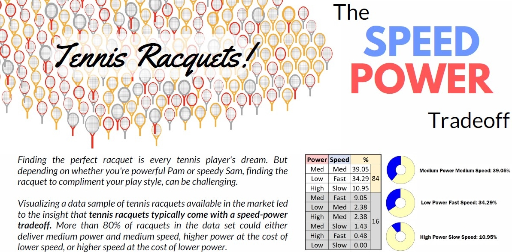
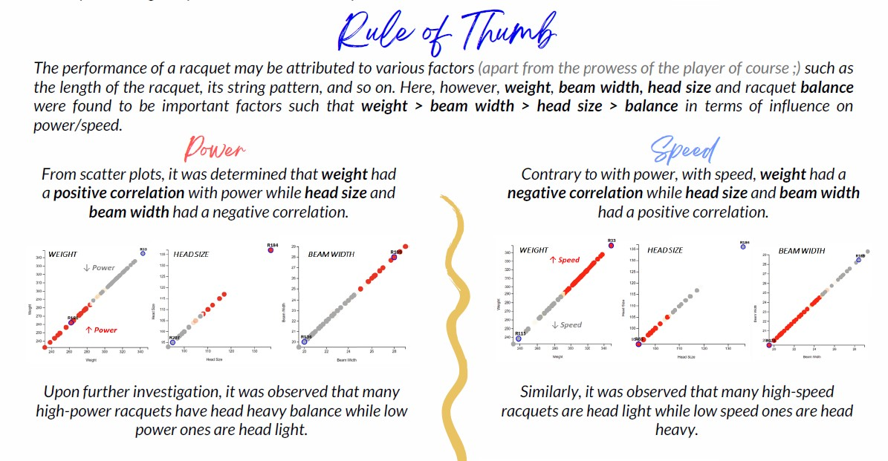
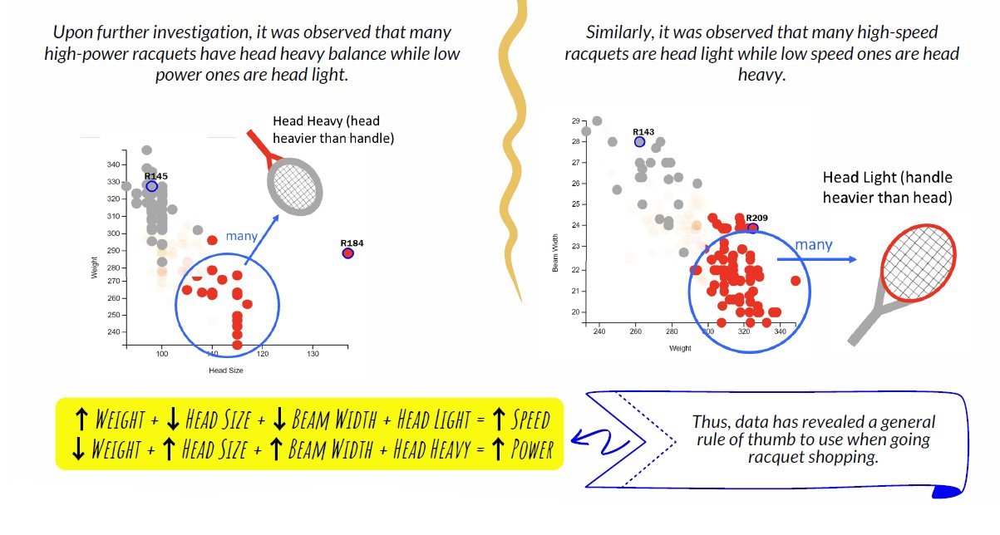
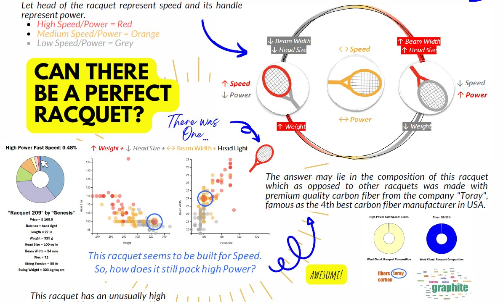
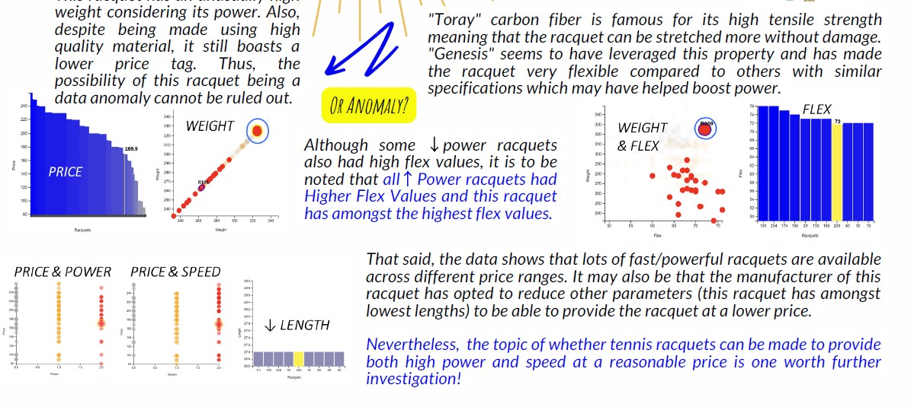
</p>

The above poster was designed on [www.canva.com](https://www.canva.com/features/) using only content from the dashboard and using Microsoft Power Point to edit images (crop them, add extra titles, etc).

## 4. Testing

A **modular testing** approach was adopted with this project where each feature upon implementation was tested immediately. 

Different ways in which a feature may get buggy/break were explored by trying out various ways in which a user may interact with each dashboard component.

The approach of **unit testing** adopted for this project led to early discovery of various bugs allowing for there to be enough time to fix them before submission.  Since various units of the dashboard interact with each other, in addition to testing intended performance of each individual component, tests were also conducted after already tested components were placed together to ensure non-problematic integration of the different components in to the dashboard.

**An example of a bug found and fixed in this way is as follows.**

* The the bar plot when tested on its own worked perfectly.

* When integrated into the dashboard, the feature that allows user to zoom/traverse the bars of the bar graph broke due to interference with other event listeners of other existing plots which were also attached to the same "body" DOM element.

* This was fixed by introducing a plot focus mechanism such that focus would be brought onto a plot only when the mouse cursor is over that plot. At any given time, event listeners associated with a plot if any, will only be active if that plot is in focus. 

At the time of submission of this project, there are no known bugs as confirmed after ample testing and code works as it was intended to.

## 5. Limitations and Possible Extensions

The following are few limitations w.r.t. this lab solution and possible extension ideas that  can make the dashboard better.

* The dataset though having provided great visualization opportunities (the reason for choosing it), lacked in no. of data instances/samples. It may have been possible to discover more interesting and definitive trends/stories if there was more data of the same kind.

* A zoom and pan on brushing can be added to the scatter plot so that the user is able to focus on few points more (like for example to focus on other points while ignoring outliers). 

* A cluster plot that performs multidimensional clustering based on identified features with best correlation could be added.

* A ML model could be built that could try to predict the power/speed of a racquet based on its specifications. This could be a great way of demonstrating existence of discovered patterns in the data.

## References

Coding style followed for this lab was based on learning acquired from previous labs. The [D3 Graph Gallery](https://d3-graph-gallery.com/) website was also found to be very helpful both w.r.t. exploring ideas for visualizations as well as for basic introductions on how to implement some parts of layouts.